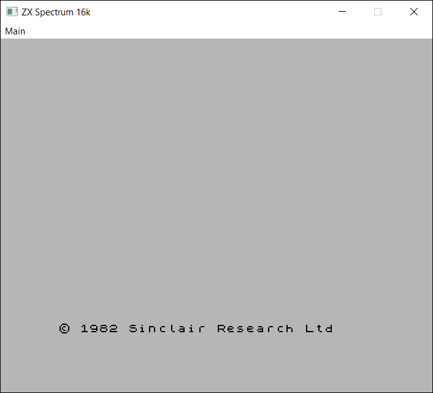
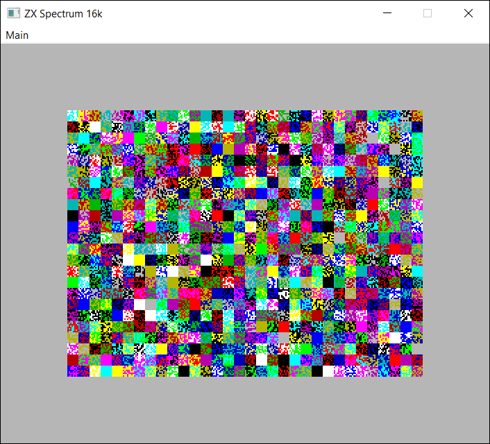

SPECTRUSTY Tutorial
===================

This is a part of the [tutorial] for the [SPECTRUSTY] library.

In this step, you can learn how to build a minimal working emulator.



Step 1 - Baby steps
-------------------

First, let's [prepare your Rust crate](https://doc.rust-lang.org/cargo/getting-started/first-steps.html) then add the following to the `Cargo.toml` of your project:

```toml
[dependencies]
spectrusty = "0.1"
```

To make this super easy, let's say we want to build a bare ZX Spectrum 16k without any peripherals.

What we need is a `CPU`, some memory, and a chipset.

Let's define a struct for holding our components:

```rust
use spectrusty::z80emu::{Cpu, Z80NMOS};
use spectrusty::chip::{ControlUnit, MemoryAccess, ula::UlaPAL};
use spectrusty::memory::Memory16k;

struct ZxSpectrum16k {
    cpu: Z80NMOS,
    ula: UlaPAL<Memory16k>
}
```

As you can see, there is a lot of imports involved... and there'll be much, much more. While you could use the glob `*` facility instead, this way, you can better see where each component originates from.

So far, we have added a CPU type and a chipset with the concrete memory. The `Memory16k` type is declared in place of the chipset's generic parameter - `M`.

[Ula] implements the heart of one of ZX Spectrum 16k or 48k version, and [UlaPAL] is a slightly more specialized type for the 50Hz PAL version.

But what if you wanted to use another type of memory or a CPU while reusing the same code?

We can refactor our struct slightly so it can also accept generic parameters:

```rust
// ... more imports going in order
use spectrusty::memory::{ZxMemory, Memory16k, Memory48k};

#[derive(Default)]
struct ZxSpectrum<C: Cpu, M: ZxMemory> {
    cpu: C,
    ula: UlaPAL<M>
}

// Let's create some sugar definitions
type ZxSpectrum16k<C> = ZxSpectrum<C, Memory16k>;
type ZxSpectrum48k<C> = ZxSpectrum<C, Memory48k>;
```

Sooo.. we can use a different memory type and also a different CPU variant. For example: [Z80CMOS].

Now for the `main` dish:

```rust
// we can always work on errors later, this is always an easy default
type Result<T> = core::result::Result<T, Box<dyn std::error::Error>>;

fn main() -> Result<()> {
    let spectrum = ZxSpectrum16k::<Z80NMOS>::default();
    //...
    Ok(())
}
```

In the later steps, I'll show you how to make this struct accept other types of chipsets.

Finally, we have created an instance of a ZX Spectrum model.

But how exactly do we run it? And what does it even mean?

The `spectrum` object represents a kind of a Finite State Machine, perhaps even a [Turing Machine]. So by running it, I mean that the machine can alter its state by executing instructions.

The state of this particular FSM is being changed by executing the Z80 machine code that resides in its memory. So... it would be better to have some code loaded first before trying to run anything. Otherwise, the CPU will be executing a series of `NOP`s (0x00) followed by `RST 38` (0xFF) in the upper 32kb RAM.

Let's just load the original Spectrum's [ROM] software into the emulated memory:

```rust
    let rom_file = std::fs::File::open("resources/roms/48.rom")?;
    spectrum.ula.memory_mut().load_into_rom(rom_file)?;
```

You may get a copy of a [48.rom] file as Amstrad has kindly given open permission to re-distribute the Spectrum's ROM content.

Now, can we finally run it?

Short answer: yes.

Long answer: yes, but how would you know if something is even happening inside the FSM? I think that you'd like to see and hear the side-effects of changes of the Spectrum's internal state. It would be even better if you could provide it with some input, like keyboard presses.

Not only do we need to execute the Z80 code, but we also need to render some side effects and accept user input at the same time.

Well... we can start by observing how `ULA` generates its video signal.

In television sets and computer monitors, the entire front area of the tube is scanned repetitively and systematically from top to bottom by the electron beam. ULA provides color information for the raster beam while the screen is being produced. It does so for the fixed number of CPU cycles. Then repeats the whole process again and again.

A single pass of a raster beam is a video frame. The number of CPU cycles (or `T-states` that are being used as time units here) of every frame always stays the same.

Now it becomes obvious: the emulator should be run in a loop. First, it should run code for the constant number of cycles. Then from the collected data, it should render a video raster as an image and the sound as short audio samples. Then it should poll user input and pass it to the state machine. Rinse and repeat.

```rust
// yeah...more imports...
use spectrusty::video::{
    Video, Palette, PixelBuffer, BorderSize,
    pixel::{PixelBufA24, SpectrumPalRGB24}
};
use spectrusty::peripherals::{KeyboardInterface, ZXKeyboardMap};

fn main() -> Result<()> {
    //... ✂
    //... later in main()

    // here for simplicity we hard code the largest possible border
    let border = BorderSize::Full;

    while is_running() {
        spectrum.update_keyboard( update_keys );

        spectrum.run_frame();

        let (width, height) =
            <UlaPAL<Memory16k> as Video>::render_size_pixels(border);
        let (video_buffer, pitch) = acquire_video_buffer(width, height);
        spectrum.render_video::<SpectrumPalRGB24>(
            video_buffer,
            pitch,
            border);

        update_display();

        synchronize_frame();
    }
}
```

The [PixelBuffer] trait is for handling the way pixel colors are being placed into the byte buffers. There are a few implementations of `PixelBuffer` available in the [video::pixel] module for most common pixel formats. For the purpose of this example, we will use [PixelBufA24] that defines a single color pixel as an array of 3 bytes representing: red, green, and blue channels. The [SpectrumPalRGB24] is an implementation of the [Palette] trait providing particular colors.

Functions such as: `is_running`, `update_keys`, `acquire_video_buffer`, and `update_display` depend solely on the emulator host environment and is out of the scope of this library. The implementation for them should be provided by the emulator builder. However, the [spectrusty-utils] crate can help when dealing with [keyboard events].

You may later check the implementation of this tutorial [step1.rs] or the examples directory of SPECTRUSTY repository to see how it can be done for [SDL2] or a [web browser].

Now let's look inside our new `ZxSpectrum`'s methods:

```rust
// the type of PixelBuffer (so we can easily replace it).
type PixelBuf<'a> = PixelBufA24<'a>;
// the type of PixelBuffer::Pixel.
type Pixel<'a> = <PixelBuf<'a> as PixelBuffer<'a>>::Pixel;

impl<C: Cpu, M: ZxMemory> ZxSpectrum<C, M> {
    fn update_keyboard<F: FnOnce(ZXKeyboardMap) -> ZXKeyboardMap>(
            &mut self,
            update_keys: F)
    {
        let keymap = update_keys( self.ula.get_key_state() );
        self.ula.set_key_state(keymap);
    }
    // this one looks very simple, however we will add more to this
    // function later so let's not give up on it yet.
    fn run_frame(&mut self) {
        self.ula.execute_next_frame(&mut self.cpu);
    }
    // `buffer` is a mutable slice of bytes.
    // `pitch` is the number of bytes that the single row of pixels occupy.
    // `border` determines the size of the rendered screen.
    fn render_video<'a, P: Palette<Pixel=Pixel<'a>>>(
        &mut self,
        buffer: &mut [u8],
        pitch: usize,
        border: BorderSize)
    {
        self.ula.render_video_frame::<PixelBuf, P>(buffer, pitch, border);
    }
    // so we can reset our Spectrum
    fn reset(&mut self, hard: bool) {
        self.ula.reset(&mut self.cpu, hard)
    }
    // so we can trigger Non-Maskable Interrupt
    fn trigger_nmi(&mut self) -> bool {
        self.ula.nmi(&mut self.cpu)
    }
}
```

The [Palette] trait is for retrieving actual pixel colors corresponding to Spectrum's color palette.
You may define a palette implementation yourself or use one of the palettes defined in the [video::pixel] module. Remember that the associated [Palette::Pixel] type should match the type of [PixelBuffer::Pixel].

The last missing part is synchronization. After each iteration of the emulator loop, it needs to pause the running thread for some time to match the rate of Spectrum's CPU clock.

For this purpose, you can use [ThreadSyncTimer]:

```rust
// just one new import?
use spectrusty::chip::ThreadSyncTimer;

fn main() -> Result<()> {
    //... ✂
    //... later in main()

    let frame_duration_nanos =
        <UlaPAL<Memory16k> as HostConfig>::frame_duration_nanos();
    let mut sync = ThreadSyncTimer::new(frame_duration_nanos);
    let mut synchronize_frame = || {
        if let Err(missed) = sync.synchronize_thread_to_frame() {
            println!("*** lagging behind: {} frames ***", missed);
        }
    };

    while is_running() {
        //... ✂
        synchronize_frame();
    }
}
```

Assuming you have taken care of the host environment, this is enough to run your ZX Spectrum emulator. At this point, you should be able to write BASIC programs using a keyboard.


### Some entropy



To make your Spectrum feel slightly more real, let's initialize its memory with some randomness at boot time.

First, you need to add the [rand] crate to your `Cargo.toml`:

```toml
[dependencies]
spectrusty = "0.1"
rand = "0.7"
```

then add:

```rust
use rand::prelude::*;

fn main() -> Result<()> {
    //... ✂
    // some entropy in memory for nice visuals at boot
    spectrum.ula.memory_mut().fill_mem(.., random)?;
    // get the software
    let rom_file = std::fs::File::open("resources/roms/48.rom")?;
    // put the software into the hardware
    spectrum.ula.memory_mut().load_into_rom(rom_file)?;
    //... ✂
}
```

### Generalized solution

Up to this moment, we assumed only one specific Spectrum type can be used in your program. What if you'd like to be able to switch the Spectrum model run-time?

For that, we'll have to slightly pivot and embrace generics a little bit more. If you are new to Rust, it would be wise to read more about generic types now, [here in this book](https://doc.rust-lang.org/book/ch10-00-generics.html).

First, let's move out the emulator loop part to the separate, polymorphic function:

```rust
fn run<C: Cpu, M: ZxMemory>(
        spectrum: &mut ZxSpectrum<C, M>,
        env: HostEnvironment,
    ) -> Result<Action>
{
    let HostEnvironment { border, ... } = env;
    let (width, height) = <UlaPAL<M> as Video>::render_size_pixels(border);

    let mut sync = ThreadSyncTimer::new(
                    UlaPAL::<M>::frame_duration_nanos());
    let mut synchronize_frame = || {
        if let Err(missed) = sync.synchronize_thread_to_frame() {
            println!("*** paused for: {} frames ***", missed);
        }
    };

    // emulator main loop
    while is_running() {
        //... ✂
        if Some(model) = user_want_to_switch_model() {
            return Ok(Action::ChangeModel(model))
        }

        synchronize_frame();
    }

    Ok(Action::Exit)
}
```

The generic parameters are the same as used with the `ZxSpectrum` struct definition, so nothing interesting is happening yet.

Now, the `HostEnvironment` struct will wrap everything that is needed to run the emulator in the host environment. This includes a window handle, video buffer, audio host, event pump, etc. The new function accepts a mutable reference to the `ZxSpectrum` and returns an action request, which may look like this:

```rust
#[derive(Debug, Clone, Copy)]
enum Action {
    ChangeModel(ModelReq),
    Exit
}

#[derive(Debug, Clone, Copy)]
enum ModelReq {
    Spectrum16,
    Spectrum48,
}
```

In the `main` we need to add a loop that calls `run` and changes the model according to the request, or just exits the whole program:

```rust
    let mut spec16 = ZxSpectrum16k::<Z80NMOS>::default();
    //... ✂
    let mut spectrum = ZxSpectrumModel::Spectrum16(spec16);

    loop {
        use ZxSpectrumModel::*;
        let env = bundle_environment(/*...*/);
        let req = match &mut spectrum {
            Spectrum16(spec16) => run(spec16, env)?,
            Spectrum48(spec48) => run(spec48, env)?
        };

        spectrum = match req {
            Action::ChangeModel(spec) => spectrum.change_model(spec),
            Action::Exit => break
        };
    }
```

The only missing parts are the `ZxSpectrumModel` enum, which should be straightforward:

```rust
enum ZxSpectrumModel<C: Cpu> {
    Spectrum16(ZxSpectrum16k<C>),
    Spectrum48(ZxSpectrum48k<C>),
}
```
... and its implementation. Actually, we can make it a little more interesting by implementing model hot-swapping.

```rust
impl<C: Cpu> ZxSpectrumModel<C> {
    fn into_cpu(self) -> C {
        match self {
            ZxSpectrumModel::Spectrum16(spec16) => spec16.cpu,
            ZxSpectrumModel::Spectrum48(spec48) => spec48.cpu,
        }        
    }
    fn as_mem_ref(&self) -> &[u8] {
        match self {
            ZxSpectrumModel::Spectrum16(spec16) =>
                    spec16.ula.memory_ref().mem_ref(),
            ZxSpectrumModel::Spectrum48(spec48) =>
                    spec48.ula.memory_ref().mem_ref(),
        }
    }
    fn border_color(&self) -> u8  {
        match self {
            ZxSpectrumModel::Spectrum16(spec16) =>
                            spec16.ula.border_color(),
            ZxSpectrumModel::Spectrum48(spec48) =>
                            spec48.ula.border_color(),
        }
    }
    // hot-swap hardware models
    fn change_model(self, request: ModelReq) -> Self {
        use ZxSpectrumModel::*;
        match (&self, request) {
            (Spectrum16(..), ModelReq::Spectrum16)|
            (Spectrum48(..), ModelReq::Spectrum48) => return self,
            _ => {}
        }
        let mem = self.as_mem_ref();
        let border = self.border_color();
        match request {
            ModelReq::Spectrum16 => {
                let mut spec16 = ZxSpectrum16k::<C>::default();
                let mem16 = spec16.ula.memory_mut().mem_mut();
                let len = mem16.len().min(mem.len());
                mem16[..len].copy_from_slice(&mem[..len]);
                spec16.cpu = self.into_cpu();
                spec16.ula.set_border_color(border);
                Spectrum16(spec16)
            }
            ModelReq::Spectrum48 => {
                let mut spec48 = ZxSpectrum48k::<C>::default();
                let mem48 = spec48.ula.memory_mut().mem_mut();
                let len = mem48.len().min(mem.len());
                mem48[..len].copy_from_slice(&mem[..len]);
                spec48.cpu = self.into_cpu();
                spec48.ula.set_border_color(border);
                Spectrum48(spec48)
            }
        }
    }
}
```

I think that's enough for this step. More models will come in the future, and we'll extend the `run` function yet many times over, that's for sure. Just stay with me for a little bit longer.


### Example

The [example][step1.rs] program using [minifb] and covering the scope of this tutorial can be run with:

```sh
cargo run --bin step1 --release
```

[![ZX Spectrum keyboard layout][keyboard]][keyboard]


### Next

[Step 2 - Buzz on](step2.md).

Back to [index][tutorial].

<script>var clicky_site_ids = clicky_site_ids || []; clicky_site_ids.push(101270192);</script>
<script async src="//static.getclicky.com/js"></script>

[SPECTRUSTY]: https://royaltm.github.io/spectrusty/
[tutorial]: https://royaltm.github.io/spectrusty-tutorial/
[step1.rs]: https://github.com/royaltm/spectrusty-tutorial/blob/master/src/bin/step1.rs
[minifb]: https://crates.io/crates/minifb
[Turing Machine]: https://cs.stackexchange.com/questions/16729/are-real-computers-finite-state-machines
[prepare your Rust crate]: https://doc.rust-lang.org/cargo/getting-started/first-steps.html
[spectrusty-utils]: https://crates.io/crates/spectrusty-utils
[keyboard events]: https://docs.rs/spectrusty-utils/*/spectrusty_utils/keyboard/
[ROM]: https://github.com/royaltm/spectrusty/tree/master/resources/
[48.rom]: https://github.com/royaltm/spectrusty/tree/master/resources/roms/48.rom
[SDL2]: https://github.com/royaltm/spectrusty/tree/master/examples/sdl2-zxspectrum/
[web browser]: https://github.com/royaltm/spectrusty/tree/master/examples/web-zxspectrum/
[minifb]: https://crates.io/crates/minifb
[rand]: https://crates.io/crates/rand
[Ula]: https://docs.rs/spectrusty/*/spectrusty/chip/ula/struct.Ula.html
[UlaPAL]: https://docs.rs/spectrusty/*/spectrusty/chip/ula/type.UlaPAL.html
[Z80CMOS]: https://docs.rs/z80emu/*/z80emu/z80/type.Z80CMOS.html
[PixelBuffer]: https://docs.rs/spectrusty/*/spectrusty/video/pixel/trait.PixelBuffer.html
[PixelBuffer::Pixel]: https://docs.rs/spectrusty/*/spectrusty/video/pixel/trait.PixelBuffer.html#associatedtype.Pixel
[Palette]: https://docs.rs/spectrusty/*/spectrusty/video/pixel/trait.Palette.html
[Palette::Pixel]: https://docs.rs/spectrusty/*/spectrusty/video/pixel/trait.Palette.html#associatedtype.Pixel
[video::pixel]: https://docs.rs/spectrusty/*/spectrusty/video/pixel/index.html
[PixelBufA24]: https://docs.rs/spectrusty/*/spectrusty/video/pixel/struct.PixelBufA24.html
[SpectrumPalRGB24]: https://docs.rs/spectrusty/*/spectrusty/video/pixel/struct.SpectrumPalRGB24.html
[ThreadSyncTimer]: https://docs.rs/spectrusty/*/spectrusty/chip/struct.ThreadSyncTimer.html
[keyboard]: keyboard48.jpg