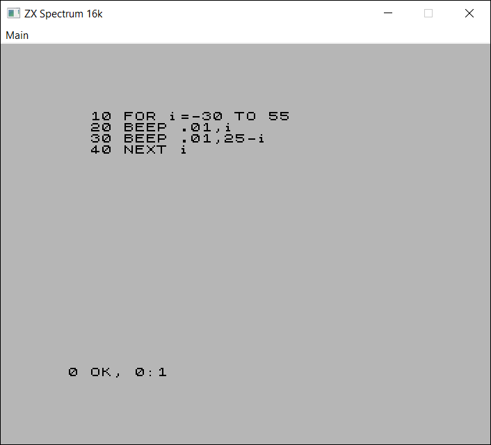
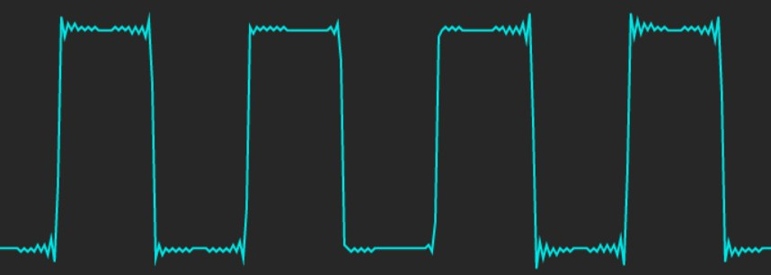

SPECTRUSTY Tutorial
===================

This is a part of the [tutorial] for the [SPECTRUSTY] library.

In this step, you can learn how to make your emulator emit sound.



Step 2 - Buzz on
----------------

Wouldn't it be nice if your Spectrum could at least `BEEP` and make some keystroke noises?

Unfortunately, synthesizing and playing the audio stream isn't very easy. That's why this whole step is solely dedicated to making your emulator go beep buzz beep.

There are some challenges involved:

* First, we need to produce some audio samples from data collected while running a single loop iteration.
* Next, we need to seamlessly stream those samples into the audio output device.

Let's now focus on the first challenge.

If you understand the first challenge, just skip the following 4 paragraphs and go straight to the solution.

Bare ZX Spectrum produces sound by alternating the voltage on its EAR and MIC output lines. Only two states are possible: high or low. If this state is changing fast enough, we could hear some tone. But the shape of such a sound wave is not the natural sinusoid but instead is [square][square wave].

The perfect square wave can be represented as an infinite sum of sinusoidal waves. The problem (definitely oversimplified here) is that the frequency of those waves tends to infinity. The digitized sound is limited by the finite sample frequency. The maximum frequency that can be sampled is called the [Nyquist frequency], which is half of the sampling frequency - usually at around 22kHZ (upper human hearing ability limit).

When the emulator runs, the changes to the EAR and MIC states are recorded as timestamps. The frequency of the CPU clock is around 3.5 MHz. That is around `79` (`3_500_000 / 44100`) times more than the typical audio sample frequency. We have to somehow downscale the frequency without losing the sound quality. Digitized square waves that sound clear should be constructed from a limited number of sinusoidal waves. The computation of such waves would be costly.

Fortunately, audio engineers have noticed that the [pattern of the square steps] is independent of the sampling frequency. Thus, it should be easy to pre-calculate this pattern and apply it to the stepping changes, with a little bit of scaling. This technique is called [Hard sync].

The solution is a Bandwidth-Limited Pulse Buffer (`BLEP`). If you want to know the details, don't hesitate to read an excellent [sync tutorial].


### Synthesizing



With SPECTRUSTY to generate audio samples, follow these steps for each frame:

1. add some amplitude steps to the `BLEP` that correspond to the `EAR/MIC` line changes (or other sources),
2. finalize the `BLEP` frame,
3. render the `BLEP` frame as audio samples,
4. prepare the `BLEP` for the next frame.

For the sake of flexibility, sample steps are added via [Blep] trait. Different `BLEP` implementations can be used this way. In the [spectrusty-audio], there is one such [implementation][audio::synth] out of the box.

Let's now adapt your emulator:

First, we need to enable the audio feature to access the [audio::synth] module in `Cargo.toml`:

```toml
[dependencies]
spectrusty = { version = "0.1", features = ["audio"] }
```

then to your program:

```rust
// Yasss... more imports coming your way...
use spectrusty::audio::{
    Blep, AudioFrame, EarMicOutAudioFrame,
    AudioSample, FromSample, EarMicAmps4,
    synth::BandLimited
};

// the type of the Blep implementation amplitude delta
type BlepDelta = f32; // i16 or i32 can be also used instead

fn main() -> Result<()> {
    //... ✂
    //... later in main

    // first let's get an instance of some audio device implementation
    let audio = create_audio();
    // second the Bandwidth-Limited Pulse Buffer implementation with
    // a single channel
    let mut blep = BandLimited::<BlepDelta>::new(1);
    // we need a sample frequency of the audio output
    let sample_rate: u32 = audio.sample_rate().into();
    // ensure the Blep implementation is prepared for pulses
    spectrum.ula.ensure_audio_frame_time(&mut blep, sample_rate);
    //... ✂
}

fn run<C: Cpu, M: ZxMemory>(
        spectrum: &mut ZxSpectrum<C, M>,
        env: HostEnvironment,
    ) -> Result<Action>
{
    let HostEnvironment { audio, blep, border, ... } = env;
    let (width, height) = <UlaPAL<M> as Video>::render_size_pixels(border);
    //... ✂
    while is_running() {
        spectrum.update_keyboard( update_keys );

        spectrum.run_frame();

        let (video_buffer, pitch) = acquire_video_buffer(width, height);
        spectrum.render_video::<SpectrumPalRGB24>(
                                        video_buffer, pitch, border);
        // (1) and (2)
        spectrum.render_audio(&mut blep);

        update_display();

        // (3) render the BLEP frame as audio samples
        produce_audio_frame(
            audio.channels(), audio.frame_buffer(), &mut blep);
        // somehow play the rendered buffer
        audio.play_frame()?;

        // (4) prepare the BLEP for the next frame.
        blep.next_frame();

        //... ✂
    }
    Ok(Action::Exit)
}
```

Let's look closer at the steps 1 and 2:

```rust
impl<C: Cpu, M: ZxMemory> ZxSpectrum<C, M> {
    // a generic function that will accept any Blep implementation
    fn render_audio<B: Blep<SampleDelta=BlepDelta>>(
            &mut self,
            blep: &mut B
        ) -> usize
    {
        // (1) add some amplitude steps to the BLEP that correspond to
        // the EAR/MIC line changes
        self.ula.render_earmic_out_audio_frame::<EarMicAmps4<BlepDelta>>(
            blep,
            0);
        // (2) finalize the BLEP frame
        self.ula.end_audio_frame(blep)
    }
}
```

[EarMicAmps4] is an implementation of [AmpLevels] trait. This trait is responsible for translating the digital audio levels to the sample amplitudes. In case there are more than 2 levels, their corresponding amplitudes should scale exponentially.

We can interpret EAR and MIC lines as 4 digital levels:

```
EAR  MIC  level
 0    0     0
 0    1     1
 1    0     2
 1    1     3
```

And that is exactly what [EarMicOutAudioFrame::render_earmic_out_audio_frame] method does. If you only want to hear the EAR changes and ignore the MIC changes, you can replace [EarMicAmps4] with [EarOutAmps4].

Now, step 3. In this example, we assume the `audio` object is capable of providing an audio buffer as a [vector][Vec<T>] of audio samples `T`:

```rust
fn produce_audio_frame<T: AudioSample + FromSample<BlepDelta>>(
        output_channels: usize,
        outbuf: &mut Vec<T>,
        blep: &mut BandLim
    )
{
    // the BLEP buffer summing iterator of the channel 0
    let sample_iter = blep.sum_iter::<T>(0);
    // the number of samples that the iterator will generate
    let frame_sample_count = sample_iter.len();
    // ensure the size of the audio frame buffer is exactly as we need it
    outbuf.resize(frame_sample_count * output_channels, T::silence());
    // render each sample
    for (chans, sample) in outbuf.chunks_mut(output_channels)
                                 .zip(sample_iter)
    {
        // write sample to each channel
        for p in chans.iter_mut() {
            *p = sample;
        }
    }
}

```

The generic audio sample type `T` may be different from the `BlepDelta` as long as it can be converted from `BlepDelta` with the [FromSample] trait.

In step 4, the method [next_frame] is called on the `blep` object.

That basically covers the topic of creating audio samples.


### Streaming

How to play audio seamlessly is another cookie to crunch.

Most of the audio frameworks usually spawn a dedicated thread that periodically calls your function to fill the output buffer just in time to be played. To our emulator's loop, this is a completely asynchronous process.

To overcome this hurdle, Spectrusty introduces the [Carousel]. It consists of an interconnected pair of an audio producer and a consumer. The consumer lives in the audio thread. The producer is available in our loop. The producer can send the audio frame buffer of the arbitrary size to the consumer and the consumer when called by the audio framework fills the audio output buffer with our audio frame data and then sends it back to be filled again. We can control how many buffers are in the circulation thus influencing the latency and stability of the sound playback stream.

To simplify this task there are some platform-specific features that can be enabled:

```toml
[dependencies]
spectrusty = { version = "0.1", features = ["audio", "cpal"] } # or "sdl2"
```

providing the complete carousel solutions for [cpal] audio layer or [SDL2].

I won’t go into details on how to implement the carousel for any particular framework, because a quick look to the [spectrusty-audio::host] should reveal all its secrets.


### Example

The [example][step2.rs] program using [minifb] and [cpal], covering the scope of this tutorial can be run with:

```sh
cargo run --bin step2 --release
```


### Next

[Step 3 - R Tape loading error](step3.md).

Back to [index][tutorial].

<script>var clicky_site_ids = clicky_site_ids || []; clicky_site_ids.push(101270192);</script>
<script async src="//static.getclicky.com/js"></script>

[SPECTRUSTY]: https://royaltm.github.io/spectrusty/
[tutorial]: https://royaltm.github.io/spectrusty-tutorial/
[step2.rs]: https://github.com/royaltm/spectrusty-tutorial/blob/master/src/bin/step2.rs
[minifb]: https://crates.io/crates/minifb
[cpal]: https://crates.io/crates/cpal
[square wave]: https://en.wikipedia.org/wiki/Square_wave
[Nyquist frequency]: https://en.wikipedia.org/wiki/Nyquist_frequency
[pattern of the square steps]: https://en.wikipedia.org/wiki/Square_wave#Fourier_analysis
[Hard sync]: https://www.cs.cmu.edu/~eli/papers/icmc01-hardsync.pdf
[sync tutorial]: http://www.slack.net/~ant/bl-synth
[SDL2]: https://www.libsdl.org/index.php
[Blep]: https://docs.rs/spectrusty/*/spectrusty/audio/trait.Blep.html
[spectrusty-audio]: https://docs.rs/spectrusty-audio/
[EarMicOutAudioFrame::render_earmic_out_audio_frame]: https://docs.rs/spectrusty-core/*/spectrusty_core/audio/trait.EarMicOutAudioFrame.html#tymethod.render_earmic_out_audio_frame
[EarMicAmps4]: https://docs.rs/spectrusty/*/spectrusty/audio/struct.EarMicAmps4.html
[EarOutAmps4]: https://docs.rs/spectrusty/*/spectrusty/audio/struct.EarOutAmps4.html
[AmpLevels]: https://docs.rs/spectrusty/*/spectrusty/audio/trait.AmpLevels.html
[Vec<T>]: https://doc.rust-lang.org/std/vec/struct.Vec.html
[FromSample]: https://docs.rs/spectrusty/*/spectrusty/audio/trait.FromSample.html
[Carousel]: https://docs.rs/spectrusty/*/spectrusty/audio/carousel/index.html
[audio::synth]: https://docs.rs/spectrusty/*/spectrusty/audio/synth/index.html
[spectrusty-audio::host]: https://docs.rs/spectrusty-audio/*/spectrusty_audio/host/index.html
[next_frame]: https://docs.rs/spectrusty-audio/*/spectrusty_audio/synth/struct.BandLimited.html#method.next_frame