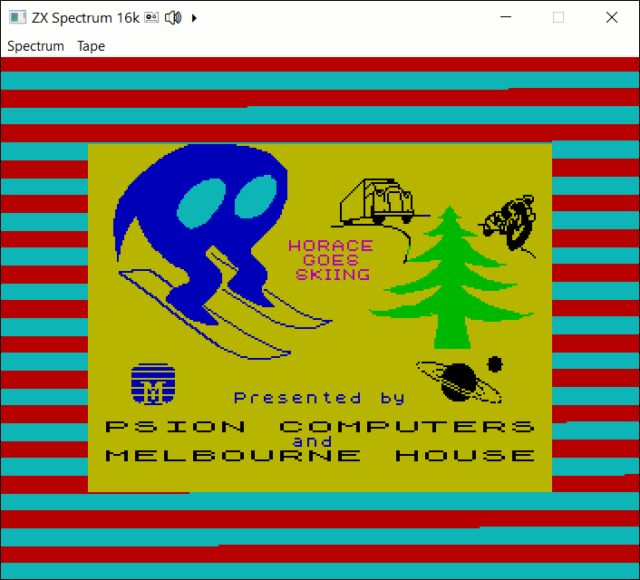

SPECTRUSTY Tutorial
===================

This is a part of the [tutorial] for the [SPECTRUSTY] library.


Step 3 - R Tape loading error
-----------------------------

After finishing the previous steps, you can now enjoy the whole magnificence of the Spectrum's BASIC. You may draw CIRCLEs, change the BORDER color, or even BEEP some tunes. That is if you have enough patience to write everything from scratch every time you boot the emulator. A ZX Spectrum BASIC mandala. Perfect!

So what if you could SAVE programs... and LOAD them back? I'm speaking, of course, in terms of magnetic tapes here, [cassettes], yeah those things. Are you still with me? Great!

As your new Spectrum lives in a digital world only, we have to forget about those reel-to-reels. The magnetic fields generated by the recorder's head is getting replaced by the digital [TAP] format.

Spectrum communicates with the tape recorder via two lines:

* `EAR IN` to LOAD data from tape, and
* `MIC OUT` to SAVE data.

The communication signal has a form of pulses. Longer pulses are ones, and shorter are zeros. There are also lead and synchronization pulses, but that is not so important right now.

We need those emitted pulses to be decoded into [TAP] bytes, and vice-versa, [TAP] bytes encoded as pulses.

The good news is, the part of SPECTRUSTY is also ... [spectrusty-formats] crate! You can parse and construct some popular data formats. For TAPs, you can "play" and "record" their content as pulses.

First, let's add some more imports...

```rust
use core::convert::TryFrom;
use core::fmt::Write;
use std::fs::{File, OpenOptions};
// to log some actions
#[allow(unused_imports)]
use log::{error, warn, info, debug, trace};
// more audio raleted imports, here we go...
use spectrusty::audio::{
        AudioSample, EarMicAmps4, EarOutAmps4, EarInAmps2,
        Blep, AudioFrame, FromSample, EarMicOutAudioFrame, EarInAudioFrame
        synth::BandLimited,
        host::cpal::AudioHandleAnyFormat
};
// we need two more control traits for handling EAR/MIC lines
use spectrusty::chip::{
    FrameState, ControlUnit, MemoryAccess, MicOut, EarIn,
    ThreadSyncTimer,
    ula::Ula
};
// yes, the highlight of our imports
use spectrusty::formats::tap::{read_tap_pulse_iter, TapChunkRead, TapChunkInfo};
// with some sugar on top
use spectrusty::utils::{
    tap::{Tape, Tap},
    keyboard::minifb::update_keymap
};
```

Next, you need to update your emulator and add the TAPE cassette recorder to the `ZxSpectrum` struct... The tape recorder is emulated, of course. You can also add a boolean flag if you want to turn on and off the TAPE sound being audible when played or recorded.

```rust
#[derive(Default)]
struct ZxSpectrum<C: Cpu, M: ZxMemory> {
    cpu: C,
    ula: Ula<M>,
    nmi_request: bool,
    // the state of the emulator program
    state: EmulatorState
}

#[derive(Default)]
struct EmulatorState {
    // the TAPE recorder, maybe a tape is inside?
    tape: Tape<File>,
    // do we want to hear the tape signal?
    audible_tape: bool,
}
```

For this purpose we'll use the [Tape] organizer with the [fs::File] as its data provider. You could also use [`io::Cursor<Vec<u8>>`] or anything that implements [io::Read] + [io::Write] + [io::Seek] as the [Tape] backend.

We have a new property (`state`) added to the struct. So its content needs to be moved when the user changes the model.

Here is a proposed refactoring of `ZxSpectrumModel` implementation:

```rust
impl<C: Cpu> ZxSpectrumModel<C>
{
    fn into_cpu_and_state(self) -> (C, EmulatorState) {
        match self {
            ZxSpectrumModel::Spectrum16(spec16) => (spec16.cpu, spec16.state),
            ZxSpectrumModel::Spectrum48(spec48) => (spec48.cpu, spec48.state),
        }        
    }

    //... ✂

    // hot-swap hardware models
    fn change_model(self, request: ModelReq) -> Self {
        use ZxSpectrumModel::*;
        match (&self, request) {
            (Spectrum16(..), ModelReq::Spectrum16)|
            (Spectrum48(..), ModelReq::Spectrum48) => return self,
            _ => {}
        }
        match request {
            ModelReq::Spectrum16 => Spectrum16(ZxSpectrum16k::<C>::from(self)),
            ModelReq::Spectrum48 => Spectrum48(ZxSpectrum48k::<C>::from(self))
        }
    }
}
```

The cloning part, delegated to the [From] implementation, now looks like this:

```rust
impl<C: Cpu, M: ZxMemory> From<ZxSpectrumModel<C>> for ZxSpectrum<C, M>
    where ZxSpectrum<C, M>: Default
{
    fn from(model: ZxSpectrumModel<C>) -> Self {
        let border = model.border_color();
        let other_mem = model.as_mem_ref();
        let mut spectrum = ZxSpectrum::<C, M>::default();
        let my_mem = spectrum.ula.memory_mut().mem_mut();
        let len = other_mem.len().min(my_mem.len());
        my_mem[..len].copy_from_slice(&other_mem[..len]);
        let (cpu, state) = model.into_cpu_and_state();
        spectrum.cpu = cpu;
        spectrum.state = state;
        spectrum.ula.set_border_color(border);
        spectrum
    }
}
```

Oh, and you may ask, what is this `nmi_request` thingy? I'll address this in a moment. But for now, let's get back to TAPEs.

For the sake of simplicity, we'll get the TAP file name from the first command argument that a user passed to your program.

```rust
fn main() -> Result<()> {
    // initialize logger
    simple_logger::SimpleLogger::new().with_level(log::LevelFilter::Debug).init()?;

    let mut args = std::env::args().skip(1);
    // parsing the 1st command argument as path to the TAP file
    let tap_file_name = args.next();

    //... ✂
    //... later in main

    // if the user provided us with the file name
    if let Some(file_name) = tap_file_name {
        info!("Loading TAP file: {}", file_name);
        // open the .tap file for reading and writing
        let tap_file = OpenOptions::new().read(true).write(true).create(true)
                       .open(file_name)?;
        // wrap the file into the TapChunkPulseIter
        let iter_pulse = read_tap_pulse_iter(tap_file);
        spec16.state.tape.tap = Some(Tap::Reader(iter_pulse));
        // or instead we could just write:
        // spec16.tape.insert_as_reader(tap_file);
        // by default we'd like to hear the tape sound, woudn't we?
        spec16.state.audible_tape = true;
    }
```

I almost forgot. We need to add [spectrusty-utils] to cargo deps, this time for sure:

```toml
[dependencies]
#... ✂
spectrusty-utils = "0.1"
```

That's it, for starters. Next, we need to extend the `run_frame` method so the TAPE can be played or recorded:

```rust
    // returns Ok(true) if the tape playback has ended
    fn run_frame(&mut self) -> Result<bool> {
        // get the writer if the tape is inserted and is being recorded
        if let Some(ref mut writer) = self.tape.recording_tap() {
            // extract the MIC OUT state changes as a pulse iterator
            let pulses_iter = self.ula.mic_out_pulse_iter();
            // decode the pulses as TAPE data and write it as a TAP chunk fragment
            let chunks = writer.write_pulses_as_tap_chunks(pulses_iter)?;
            if chunks != 0 {
                info!("Saved: {} TAP chunks", chunks);
            }
        }

        let mut state_changed = false;
        // get the reader if the tape is inserted and is being played
        if let Some(ref mut feeder) = self.tape.playing_tap() {
            // clean up the internal buffers of ULA so we won't append the EAR IN data
            // to the previous frame's data
            self.ula.ensure_next_frame();
            // check if any pulse is still left in the feeder
            let mut feeder = feeder.peekable();
            if feeder.peek().is_some() {
                // feed EAR IN line with pulses from our pulse iterator
                // only up to the end of a single frame
                self.ula.feed_ear_in(&mut feeder, Some(1));
            }
            else {
                // end of tape
                info!("Auto STOP: End of TAPE");
                self.tape.stop();
                state_changed = true;
            }
        }

        if self.nmi_request {
            if self.ula.nmi(&mut self.cpu) {
                self.nmi_request = false;
            }
        }
        self.ula.execute_next_frame(&mut self.cpu);

        Ok(state_changed)
    }

```

That's... a lot of things there. The good thing is, we had a dedicated function for that. Whew!

And you can also see now what the `nmi_request` was for. We also need to change the implementation of:

```rust
    fn trigger_nmi(&mut self) {
        self.nmi_request = true;
    }
```

But you may ask why? The answer won't be short, if you honestly don't care you may skip to the next paragraph. This method is now refactored in a way that the first part requires, that the previous frame's MIC data is still available. Triggering NMI takes a few CPU cycles. If we were to do it before we call this method (as was implemented before), we'll be losing this data because the `trigger_nmi` will wrap the current frame and clear all temporary buffers. This happens not because triggering NMI is somehow special, but because we are at the very end of the previous frame when the `trigget_nmi` is being invoked. All [ControlUnit] methods that forward the clock counter ensures that its value doesn't exceed some frame duration limit and calls [ControlUnit::ensure_next_frame] to conditionally prepare for the next frame. If we place the [ControlUnit::nmi] call just before the code is being executed it won't influence any side effects this way. Another funny thing is - and this is not strictly emulation related but is also an issue with the real Z80 - that the NMI won't be triggered if the executed instruction was one of the `0xDD`, `0xFD` prefixes or the `EI` instruction. If you'd fill the whole memory with one of these instructions, you'll never be able to trigger the Non-Maskable Interrupt. This is reflected in the return value from the [Cpu::nmi]. Triggering NMI may actually fail. That is why only when it returns `true` the `nmi_request` is being cleared.

I did mention something about the ability to hear the playback of the TAPE, didn't I?
So... here it is, this time only a slightly modified version of the `render_audio` method:

```rust
    // adds pulse steps to the `blep` and returns the number of samples ready to be produced.
    fn render_audio<B: Blep<SampleDelta=BlepDelta>>(&mut self, blep: &mut B) -> usize {
        // (1) add some amplitude steps to the BLEP that correspond to the EAR/MIC line changes
        if self.state.audible_tape {
            // render both EAR/MIC OUT channel
            self.ula.render_earmic_out_audio_frame::<EarMicAmps4<BlepDelta>>(blep, 0);
            // and the EAR IN channel
            self.ula.render_ear_in_audio_frame::<EarInAmps2<BlepDelta>>(blep, 0);
        }
        else {
            // render only EAR OUT channel
            self.ula.render_earmic_out_audio_frame::<EarOutAmps4<BlepDelta>>(blep, 0);
        }
        // (2) finalize the BLEP frame
        self.ula.end_audio_frame(blep)
    }
```

If `audible_tape` is `true` the user should hear the tape sound when we `LOAD` or `SAVE`. If it's `false` only beeper sound can be heard.

The only thing missing is the ability to allow the user to somehow control the TAPE. It could be implemented in the run loop with something like this:

```rust
    while is_running() {
        spectrum.update_keyboard( update_keys );

        let mut need_update_info = spectrum.run_frame();

        //... ✂

        if let Some(input) = get_user_input_request() {
            match spectrum.update_on_user_request(input)? {
                Some(action) => return Ok(action),
                None => { need_update_info = true; }
            }
        }

        if need_update_info {
            display_info(&spectrum.info()?);
        }

        synchronize_frame();
    }
```

Where `get_user_input_request` is a hypothetical UI event handler with the signature: ```() -> Option<InputRequest>```, and the `display_info` will help the user to have a clear picture of what is happening with the TAP file.

The `ZxSpectrum`'s method `update_on_user_request` might be similar to:

```rust
    fn update_on_user_request(&mut self, input: InputRequest) -> Result<Option<Action>> {
        use InputRequest::*;
        match input {
            Exit            => return Ok(Some(Action::Exit)),
            Spectrum16      => return Ok(Some(Action::ChangeModel(ModelReq::Spectrum16))),
            Spectrum48      => return Ok(Some(Action::ChangeModel(ModelReq::Spectrum48))),
            HardReset       => self.reset(true),
            SoftReset       => self.reset(false),
            TriggerNmi      => { self.trigger_nmi(); }
            TapeRewind      => { self.state.tape.rewind_nth_chunk(1)?; }
            TapePlay        => { self.state.tape.play()?; }
            TapeRecord      => { self.state.tape.record()?; }
            TapeStop        => { self.state.tape.stop(); }
            TapePrevBlock   => { self.state.tape.rewind_prev_chunk()?; }
            TapeNextBlock   => { self.state.tape.forward_chunk()?; }
            TapeAudible     => { self.state.audible_tape = !self.state.audible_tape; }
            TapeFlashLoad   => { self.state.flash_tape = !self.state.flash_tape; }
        }
        Ok(None)
    }
```

Let's look into the `info` method then, it should be self-explanatory:

```rust
    fn info(&mut self) -> Result<String> {
        let mut info = format!("ZX Spectrum {}k", self.ula.memory_ref().ram_ref().len() / 1024);
        // is the TAPE running?
        let running = self.tape.running;
        // is there any TAPE inserted at all?
        if let Some(tap) = self.tape.tap.as_mut() {
            // we'll show if the TAP sound is audible
            let audible = if self.audible_tape { '🔊' } else { '🔈' };
            match tap {
                Tap::Reader(..) if running => write!(info, " 🖭 {} ⏵", audible)?,
                Tap::Writer(..) if running => write!(info, " 🖭 {} ⏺", audible)?,
                tap => {
                    // The TAPE is paused so we'll show some TAP block metadata.
                    // This creates a TapChunkRead trait implementation that when dropped
                    // will restore underlying file seek position, so it's perfectly
                    // save to use it to read the metadata of the current chunk.
                    let mut rd = tap.try_reader_mut()?;
                    let chunk_no = rd.rewind_chunk()?;
                    let chunk_info = TapChunkInfo::try_from(rd.get_mut())?;
                    rd.done()?;
                    write!(info, " 🖭 {} {}: {}", audible, chunk_no, chunk_info)?;
                }
            }
        }
        Ok(info)
    }
```

You may now officially `SAVE` and `LOAD` bytes and programs from the TAP files.



But these games can load for so many minutes. I remember waiting patiently, fingers crossed, fearing the dread of the `R Tape Loading Error`. Today we don't have such a luxury, time flies differently, so it seems.

Let's not dawdle then, and please follow me to the remaining part of this chapter.


### Flash and Turbo

For these new capabilities, your `EmulatorState` would need some new properties:

```rust
#[derive(Default)]
struct EmulatorState {
    // the TAPE recorder, maybe a tape is inside?
    tape: Tape<File>,
    // is the emulation paused?
    paused: bool,
    // do we want to run as fast as possible?
    turbo: bool,
    // do we want to auto accelerate and enable auto load?
    flash_tape: bool,
    // do we want to hear the tape signal?
    audible_tape: bool,
}
```

The property `paused` will determine if the emulation is paused or is it running and `turbo` will indicate if the TURBO mode is on or off. Another new property `flash_tape` if `true` will enable our new FLASH TAPE LOAD and SAVE feature. I'll go into detail about it a little later in this chapter. For now, let's focus on the TURBO mode and the ability to PAUSE your emulator.

Fo the TURBO mode to work, you need to create a new method for `ZxSpectrum`:

```rust
    // run frames as fast as possible until a single frame duration passes in real-time
    // or if turbo state ends automatically
    fn run_frames_accelerated(&mut self, time_sync: &mut ThreadSyncTimer) -> Result<(FTs, bool)> {
        let mut sum: FTs = 0;
        let mut state_changed = false;
        while time_sync.check_frame_elapsed().is_none() {
            let (cycles, schg) = self.run_frame()?;
            sum += cycles;
            if schg {
                state_changed = true;
                if !self.state.turbo {
                    break;
                }
            }
        }
        Ok((sum, state_changed))
    }
```

We also need to slightly change the `run_frame` method's signature and its implementation. Additionally to the flag, it has returned previously, it'll now return the number of T-states that our emulated CPU can grind while the code is being executed. This is not really needed to implement the TURBO mode, but it can be used to benchmark the emulator's performance. You might measure the wall time of the execution of this function and divide the `sum` returned from it by the wall time duration to estimate how fast your emulated Spectrum can run in T-states / time unit.

Additionally, we'll make the TURBO mode end automatically whenever the TAPE playback ends.

```rust
    fn run_frame(&mut self) -> Result<(FTs, bool)> {
        let mut state_changed = false;
        // get the writer if the tape is inserted and is being recorded
        if let Some(ref mut writer) = self.state.tape.recording_tap() {
            //... ✂
        }

        // clean up the internal buffers of ULA so we won't append the EAR IN data
        // to the previous frame's data
        self.ula.ensure_next_frame();
        // and we also need the timestamp of the beginning of a frame
        let fts_start = self.ula.current_tstate();

        // get the reader if the tape is inserted and is being played
        if let Some(ref mut feeder) = self.state.tape.playing_tap() {
            // check if any pulse is still left in the feeder
            let mut feeder = feeder.peekable();
            if feeder.peek().is_some() {
                // feed EAR IN line with pulses from our pulse iterator
                // only up to the end of a single frame
                self.ula.feed_ear_in(&mut feeder, Some(1));
            }
            else {
                // end of tape
                info!("Auto STOP: End of TAPE");
                self.tape.stop();
                // always end turbo mode when the tape stops
                self.state.turbo = false;
                state_changed = true;
            }
        }

        self.ula.execute_next_frame(&mut self.cpu);
        let fts_delta = self.ula.current_tstate() - fts_start;

        Ok((fts_delta, state_changed))
    }
```

So the next logical step would be to apply some changes to the main emulator loop to actually handle the TURBO mode and the ability to PAUSE your Spectrum.

```rust
    // we need to change its signature, so we may share the `sync` instance.
    fn synchronize_frame(sync: &mut ThreadSyncTimer) {
        if let Err(missed) = sync.synchronize_thread_to_frame() {
            debug!("*** paused for: {} frames ***", missed);
        }
    }

    //... ✂

    'main: while is_running() {
        spectrum.update_keyboard( update_keys );

        let (_, mut state_changed) = if spectrum.state.paused {
            loop {
                if !is_running() { break 'main; }
                match get_user_input_request() {
                    Some(InputRequest::TogglePaused) => { break; }
                    Some(InputRequest::Exit) => { break 'main; }
                    _ => {}
                }
                // just rest a little bit, don't eat too much hosts' CPU cycles while paused
                std::thread::sleep(std::time::Duration::from_millis(100));
            }
            spectrum.state.paused = false;
            sync.restart();
            (0, true)
        }
        else if spectrum.state.turbo {
            spectrum.run_frames_accelerated(&mut sync)?
        }
        else {
            spectrum.run_frame()?
        };

        if let Some(input) = get_user_input_request() {
            match spectrum.update_on_user_request(input)? {
                Some(action) => return Ok(action),
                None => { state_changed = true; }
            }
        }

        let (video_buffer, pitch) = acquire_video_buffer(width, height);
        spectrum.render_video::<SpectrumPalRGB24>(video_buffer, pitch, border);

        update_display();

        if state_changed {
            if spectrum.state.turbo || spectrum.state.paused {
                // we won't be rendering audio when in TURBO mode or when PAUSED
                audio.pause();
            }
            else {
                audio.play();
            }
            window.set_title(&spectrum.info()?);
        }

        if !spectrum.state.turbo && !spectrum.state.paused {
            // no audio in TURBO mode or when PAUSED
            spectrum.render_audio(blep);
            // (3) render the BLEP frame as audio samples
            produce_audio_frame(audio.channels(), audio.frame_buffer(), &mut blep);
            // somehow play the rendered buffer
            audio.play_frame()?;
            // (4) prepare the BLEP for the next frame.
            blep.next_frame();
        }

        if !spectrum.state.turbo {
            synchronize_frame(&mut sync);
        }
    }
```

Let's not forget about TURBO and PAUSE features in the user input handler:

```rust
    fn update_on_user_request(&mut self, input: InputRequest) -> Result<Option<Action>> {
        //... ✂
            ToggleTurbo     => { self.state.turbo = !self.state.turbo; }
            TogglePaused    => { self.state.paused = true; }
        //... ✂
    }
```

When the TURBO mode is ON, it'll call `run_frames_accelerated` instead of `run_frame` and no audio will be rendered. While the emulator is `PAUSED` it'll run a simple inner loop, which just handles two conditions to either exit the main program loop or to resume from the paused state.

The TURBO mode can be changed by user `Action` or by one of the `run_` methods on certain conditions.

Speaking of conditions, we still have another feature to be taken care of: FLASH TAPE LOAD and SAVE.

First, let me describe how I imagine it would work.

When the feature is ON, whenever the user requests data from the TAPE by e.g. typing the `LOAD ""` command, the TAPE will automatically play and at the same time, the TURBO mode will be turned on automatically.

Another condition triggering the TURBO mode would be if the user has started recoding and then typed `SAVE "name"` and pressed ENTER - TAPE pulses will start being emitted by Spectrum.

The conditions, to turn OFF the TURBO mode, would be either:
* when the TAPE is playing and Spectrum no longer expects the `EAR IN` signal,
* when the TAPE is playing and it ends,
* when the TAPE is recording and the emitting of data signal ends.

The good news is, for our FLASH TAPE implementation, we only need to make some changes in `run_frame`. However, I think it's time to split this method into smaller functions because it starts to become unreadable. Not only by human programmers. The Rust optimizer doesn't really like large functions.

So here's our final `run_frame`:

```rust
    fn run_frame(&mut self) -> Result<(FTs, bool)> {
        // for tracking an effective change
        let (turbo, running) = (self.state.turbo, self.state.tape.running);

        if !self.record_tape_from_mic_out()? &&
                (self.state.flash_tape || self.state.turbo) {
            self.auto_detect_load_from_tape()?;
        }
        // clean up the internal buffers of ULA so we won't append the EAR IN data
        // to the previous frame's data
        self.ula.ensure_next_frame();
        // and we also need the timestamp of the beginning of a frame
        let fts_start = self.ula.current_tstate();

        if self.feed_ear_in_or_stop_tape()? && running {
            // only report it when the tape was running before
            info!("Auto STOP: End of TAPE");
        }

        self.ula.execute_next_frame(&mut self.cpu);

        let fts_delta = self.ula.current_tstate() - fts_start;
        let state_changed = running != self.state.tape.running ||
                            turbo   != self.state.turbo;
        Ok((fts_delta, state_changed))
    }
```

...and methods that the new `run_frame` uses:

```rust
    // returns `Ok(is_recording)`
    fn record_tape_from_mic_out(&mut self) -> Result<bool> {
        // get the writer if the tape is inserted and is being recorded
        if let Some(ref mut writer) = self.state.tape.recording_tap() {
            // extract the MIC OUT state changes as a pulse iterator
            let pulses_iter = self.ula.mic_out_pulse_iter();
            // decode the pulses as TAPE data and write it as a TAP chunk fragment
            let chunks = writer.write_pulses_as_tap_chunks(pulses_iter)?;
            if chunks != 0 {
                info!("Saved: {} TAP chunks", chunks);
            }
            if self.state.flash_tape && !self.state.turbo || self.state.turbo {
                // is the state of the pulse decoder idle?
                self.state.turbo = !writer.get_ref().is_idle();
            }
            return Ok(true)
        }
        Ok(false)
    }
```

The above function not only writes the decoded MIC signal but also controls the state of the TURBO mode whenever the [pulse decoder] changes state from IDLE to any other state. Thus if the `flash_tape` is enabled it speeds up the recording and returns to normal speed when the recording finishes.

Next is the part where we feed the `EAR IN` line from the TAPE pulses. This method returns `Ok(true)` if the TAPE has reached the end.

```rust
    // returns `Ok(end_of_tape)`
    fn feed_ear_in_or_stop_tape(&mut self) -> Result<bool> {
        // get the reader if the tape is inserted and is being played
        if let Some(ref mut feeder) = self.state.tape.playing_tap() {
            // check if any pulse is still left in the feeder
            let mut feeder = feeder.peekable();
            if feeder.peek().is_some() {
                // feed EAR IN line with pulses from our pulse iterator
                // only up to the end of a single frame
                self.ula.feed_ear_in(&mut feeder, Some(1));
            }
            else {
                // end of tape
                self.state.tape.stop();
                // always end turbo mode when the tape stops
                self.state.turbo = false;
                return Ok(true)
            }
        }
        Ok(false)
    }

```

And last but not least is the function for detecting if the TAPE should play or stop playing.

```rust
    // very simple heuristics for detecting if spectrum needs some TAPE data
    fn auto_detect_load_from_tape(&mut self) -> Result<()> {
        let count = self.ula.read_ear_in_count();
        if count != 0 {
            // if turbo is on and the tape is playing
            if self.state.turbo && self.state.tape.is_playing() {
                const IDLE_THRESHOLD: u32 = 10;
                // stop the tape and slow down
                // if the EAR IN probing falls below the threshold
                if count < IDLE_THRESHOLD {
                    self.state.tape.stop();
                    self.state.turbo = false;
                }
            }
            // if flash loading is enabled and a tape isn't running
            else if self.state.flash_tape && self.state.tape.is_inserted() &&
                   !self.state.tape.running {
                const PROBE_THRESHOLD: u32 = 1000;
                // play the tape and speed up
                // if the EAR IN probing exceeds the threshold
                if count > PROBE_THRESHOLD {
                    self.state.tape.play()?;
                    self.state.turbo = true;
                }
            }                
        }
        Ok(())
    }
```

The upside of this implementation is that we don't need to know anything about tape loading routines other than they eagerly probe the EAR IN line. So let's define some experimentally derived thresholds of the probing count per frame. If the count is above the PROBE threshold we assume the Spectrum software is waiting for the TAPE data and if it drops below the IDLE threshold we assume the TAPE data is no longer needed.

The downside is that it may sometimes render some false-positive and false-negative results. But there is always plenty of room to improve this algorithm. The very first step would be to experiment with the threshold values.

You may also check out [this implementation] which is a more sophisticated version of this method. As a bonus, it can also detect if the ROM loading routine is being called and loads data instantly.

The SAVE detection is simpler but it solely depends on the ability of the TAP writer to decode pulses.

With the final touch, you may update the `info` method to show the status of the new awesome features to the user.

```rust
    fn info(&mut self) -> Result<String> {
        let mut info = format!("ZX Spectrum {}k", self.ula.memory_ref().ram_ref().len() / 1024);
        if self.state.paused {
            info.push_str(" ⏸ ");
        }
        else if self.state.turbo {
            info.push_str(" 🏎️ ");
        }
        // is the TAPE running?
        let running = self.state.tape.running;
        // is there any TAPE inserted at all?
        if let Some(tap) = self.state.tape.tap.as_mut() {
            let flash = if self.state.flash_tape { '⚡' } else { ' ' };
            // we'll show if the TAP sound is audible
            let audible = if self.state.audible_tape { '🔊' } else { '🔈' };
            match tap {
                Tap::Reader(..) if running => write!(info, " 🖭{}{} ⏵", flash, audible)?,
                Tap::Writer(..) if running => write!(info, " 🖭{}{} ⏺", flash, audible)?,
                tap => {
                    // The TAPE is paused so we'll show some TAP block metadata.
                    // This creates a TapChunkRead trait implementation that when dropped
                    // will restore underlying file seek position, so it's perfectly
                    // save to use it to read the metadata of the current chunk.
                    let mut rd = tap.try_reader_mut()?;
                    let chunk_no = rd.rewind_chunk()?;
                    let chunk_info = TapChunkInfo::try_from(rd.get_mut())?;
                    rd.done()?;
                    write!(info, " 🖭{}{} {}: {}", flash, audible, chunk_no, chunk_info)?;
                }
            }
        }
        Ok(info)
    }
```

Aaaand it's done. You may now enjoy some ZX Spectrum software not written exclusively by you in your emulator.


### Example

The [example][step3.rs] program using [minifb] and [cpal], covering the scope of this tutorial can be run with:

```sh
cargo run --bin step3 --release -- resources/hskiing.tap
```

and type `LOAD ""` to load the game.

To create a new TAP file just give a name of a file that doesn't exist:

```sh
cargo run --bin step3 --release -- resources/my_new.tap
```

and you may actually `SAVE` your program this time.


### Next

Back to [index][tutorial].

<script>var clicky_site_ids = clicky_site_ids || []; clicky_site_ids.push(101270192);</script>
<script async src="//static.getclicky.com/js"></script>

[SPECTRUSTY]: https://royaltm.github.io/spectrusty/
[tutorial]: https://royaltm.github.io/spectrusty-tutorial/
[step3.rs]: https://github.com/royaltm/spectrusty-tutorial/blob/master/src/bin/step3.rs
[cassettes]: https://en.wikipedia.org/wiki/Cassette_tape
[minifb]: https://crates.io/crates/minifb
[cpal]: https://crates.io/crates/cpal
[spectrusty-formats]: https://docs.rs/spectrusty-formats/
[TAP]: https://docs.rs/spectrusty-formats/*/spectrusty_formats/tap/index.html
[Tape]: https://docs.rs/spectrusty-utils/*/spectrusty_utils/tap/struct.Tape.html
[fs::File]: https://doc.rust-lang.org/std/fs/struct.File.html
[io::Read]: https://doc.rust-lang.org/std/io/trait.Read.html
[io::Write]: https://doc.rust-lang.org/std/io/trait.Write.html
[io::Seek]: https://doc.rust-lang.org/std/io/trait.Seek.html
[`io::Cursor<Vec<u8>>`]: https://doc.rust-lang.org/std/io/struct.Cursor.html
[From]: https://doc.rust-lang.org/std/convert/trait.From.html
[ControlUnit]: https://docs.rs/spectrusty/*/spectrusty/chip/trait.ControlUnit.html
[ControlUnit::ensure_next_frame]: https://docs.rs/spectrusty/*/spectrusty/chip/trait.ControlUnit.html#tymethod.ensure_next_frame
[ControlUnit::nmi]: https://docs.rs/spectrusty/*/spectrusty/chip/trait.ControlUnit.html#tymethod.nmi
[Cpu::nmi]: https://docs.rs/z80emu/*/z80emu/trait.Cpu.html#tymethod.nmi
[this implementation]: https://github.com/royaltm/spectrusty/blob/master/examples/zxspectrum-common/src/spectrum.rs#L283
[pulse decoder]: https://docs.rs/spectrusty-formats/*/spectrusty_formats/tap/pulse/index.html