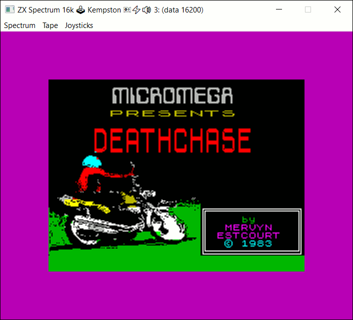

SPECTRUSTY Tutorial
===================

This is a part of the [tutorial] for the [SPECTRUSTY] library.

In this step, you can learn how add peripherals to your emulator.

[][deathchase]

Step 4 - Plug that stick
------------------------

At the end of this step, you will have a switchable joystick connected to your emulated ZX Spectrum.

I advise you to familiarize yourself with more advanced Rust features before you delve into the rest of this chapter:

* [Advanced traits](https://doc.rust-lang.org/book/ch19-03-advanced-traits.html).
* [Advanced types](https://doc.rust-lang.org/book/ch19-04-advanced-types.html).
* [Advanced functions and closures](https://doc.rust-lang.org/book/ch19-05-advanced-functions-and-closures.html).

### The BUS

At the beginning of this tutorial, I briefly stated that there is a way to add emulated peripherals. Almost all of the external devices communicate with the CPU via `IN` and `OUT` instructions. Some of them also set TRAPS that swap in and out pages of the ROM memory on certain conditions.

With SPECTRUSTY, the I/O devices can be "plugged in" using [BusDevice] API. You need to alter the [Ula] implementation by specifying the type of the required device as another generic stand-in parameter `D`. Peripherals that swap ROM pages additionally require an implementation of [MemoryExtension] trait, that can be provided as a generic parameter `X`.

We'll start with something simple. Let's connect a [Kempston Joystick] emulator. As this device needs user input, we can implement controlling joystick directions with `[←] [→] [↑] [↓]` keys and a `FIRE` button as a right `[CTRL]`.

The refactoring will begin with your `ZxSpectrum` struct, and again, you'll need more imports:

```rust
use spectrusty::bus::{
    BusDevice, NullDevice,
    joystick::{KempstonJoystick, JoystickInterface}
};
use spectrusty::chip::ula::{UlaPAL, UlaVideoFrame};
use spectrusty::clock::{FTs, VFrameTs};

#[derive(Default)]
struct ZxSpectrum<C: Cpu, M: ZxMemory, D: BusDevice> {
    cpu: C,
    // we explicitly pass D here, the implicit D is a NullDevice
    ula: UlaPAL<M, D>,
    nmi_request: bool,
    // the state of the emulator program
    state: EmulatorState
}
```

A generic `D` has now been exposed in the `ZxSpectrum` struct. It should be filled in with something that implements the [BusDevice] trait. Additionally [Ula] requires a little bit more constrained `BusDevice<Timestamp=VFrameTs<V>>`. This means that the associated constant `Timestamp` of the [BusDevice][BusDevice::Timestamp] implementation needs to be of a specific type [`VFrameTs<V>`][VFrameTs]. In our case, `V` actually is a concrete type - [UlaVideoFrame], so the actual `Timestamp` type is `VFrameTs<UlaVideoFrame>`.

`BusDevice` implementation also requires [BusDevice::NextDevice] to be defined. It determines the kind of a downstream device. Together all the devices form a chain. And the chain requires a terminating device.

For this reason, a dedicated [NullDevice] has been provided. But it still requires a generic timestamp type. That's why we will define our custom terminator:

```rust
// our terminator for the device chain
type TerminatorDevice = NullDevice<VFrameTs<UlaVideoFrame>>;
```

Now, we can refine models:

```rust
// TerminatorDevice is a default device if not specified
type ZxSpectrum16k<C, D=TerminatorDevice> = ZxSpectrum<C, Memory16k, D>;
type ZxSpectrum48k<C, D=TerminatorDevice> = ZxSpectrum<C, Memory48k, D>;

enum ZxSpectrumModel<C: Cpu, D: BusDevice=TerminatorDevice> {
    Spectrum16(ZxSpectrum16k<C, D>),
    Spectrum48(ZxSpectrum48k<C, D>),
}
```

SPECTRUSTY's [Ula] implements the [Io] protocol of the [z80emu] crate. `ULA` passes any IN/OUT request to the first `BusDevice`. The device implementation may check the `port` and determine if the request should be handled or passed down the chain.

The [VFrameTs] is used as the timestamp type passed along with the request. Some devices require to make some timestamp calculations between requests to determine the outcome.

So, requests are being handled by the following implementations:

```text
  Z80:         Cpu
  ULA:         <Ula as Io>
  1st device:  <Ula as ControlUnit>::BusDevice as BusDevice
  2nd device:  <<Ula as ControlUnit>::BusDevice as BusDevice>::NextDevice
  ...
  last device: TerminatorDevice
```

I feel like I probably should stop explaining it more and hope you haven't freaked out yet, so we can get back to our example.

As you probably have guessed, we need to modify our generic functions and implementations. First, let's change headers...

```rust
impl<C: Cpu, M: ZxMemory, D: BusDevice> ZxSpectrum<C, M, D> {
    //... ✂
}

fn run<C: Cpu, M: ZxMemory, D: BusDevice>(
        spectrum: &mut ZxSpectrum<C, M, D>,
    //... ✂
```

...but it won't compile. The problem is that we invoke methods from [ControlUnit] trait. Those methods are not implemented for every `Ula<M, D>` because they use `M` and `D` in some meaningful way. Even the condition `M: ZxMemory, D: BusDevice` is still not enough. We need to be more [specific](https://docs.rs/spectrusty/*/spectrusty/chip/trait.ControlUnit.html#impl-ControlUnit-3).

```rust
impl<C: Cpu, M: ZxMemory, D> ZxSpectrum<C, M, D>
    where D: BusDevice<Timestamp=VFrameTs<UlaVideoFrame>>
{
    //... ✂
}

fn run<C: Cpu, M: ZxMemory, D>(
        spectrum: &mut ZxSpectrum<C, M, D>,
        env: HostEnvironment,
    ) -> Result<Action>
    where D: BusDevice<Timestamp=VFrameTs<UlaVideoFrame>>
```

But this seems convoluted. Is there another way? Well, yes - let's set the constraint to directly require `ControlUnit` on the chipset implementation:

```rust
impl<C: Cpu, M: ZxMemory, D: BusDevice> ZxSpectrum<C, M, D>
    where UlaPAL<M, D>: ControlUnit
{
    //... ✂ 
}

fn run<C: Cpu, M: ZxMemory, D: BusDevice>(
        spectrum: &mut ZxSpectrum<C, M, D>,
        env: HostEnvironment,
    ) -> Result<Action>
    where UlaPAL<M, D>: ControlUnit
    //... ✂
```

Voila!

But what about implementations of the `ZxSpectrumModel` enum?

We have to take care of that too. Also, we need to adapt the hot-swap function to bring over the device aboard the target host.

```rust
impl<C, M, D> From<ZxSpectrumModel<C, D>> for ZxSpectrum<C, M, D>
    where C: Cpu,
          M: ZxMemory,
          D: BusDevice<Timestamp=VFrameTs<UlaVideoFrame>> + Default,
          ZxSpectrum<C, M, D>: Default,
{
    fn from(model: ZxSpectrumModel<C, D>) -> Self {
        let border = model.border_color();
        let other_mem = model.as_mem_ref();
        let mut spectrum = ZxSpectrum::<C, M, D>::default();
        let my_mem = spectrum.ula.memory_mut().mem_mut();
        let len = other_mem.len().min(my_mem.len());
        my_mem[..len].copy_from_slice(&other_mem[..len]);
        let (cpu, dev, state) = model.into_cpu_device_and_state();
        spectrum.cpu = cpu;
        spectrum.state = state;
        spectrum.ula.set_border_color(border);
        *spectrum.ula.bus_device_mut() = dev;
        spectrum
    }
}

impl<C: Cpu, D> ZxSpectrumModel<C, D>
    where D: BusDevice<Timestamp=VFrameTs<UlaVideoFrame>> + Default
{
    fn into_cpu_device_and_state(self) -> (C, D, EmulatorState) {
        match self {
            ZxSpectrumModel::Spectrum16(spec16) =>
                (spec16.cpu, spec16.ula.into_bus_device(), spec16.state),
            ZxSpectrumModel::Spectrum48(spec48) =>
                (spec48.cpu, spec48.ula.into_bus_device(), spec48.state),
        }        
    }

    //... ✂

    fn change_model(self, request: ModelReq) -> Self {
        use ZxSpectrumModel::*;
        match (&self, request) {
            (Spectrum16(..), ModelReq::Spectrum16)|
            (Spectrum48(..), ModelReq::Spectrum48) => return self,
            _ => {}
        }
        match request {
            ModelReq::Spectrum16 => Spectrum16(
                                        ZxSpectrum16k::<C, D>::from(self)),
            ModelReq::Spectrum48 => Spectrum48(
                                        ZxSpectrum48k::<C, D>::from(self))
        }
    }
}
```

In this instance, we can't use `UlaPAL<M, D>: ControlUnit` condition, because we don't deal with a single `M` type. We would have to define constraint for each variant of `UlaPAL` the `ZxSpectrumModel` is using. We'd better stick to the smallest common set of required constraints here.

So far, we have added some new generic parameters, but when do we plug the joystick in, huh?

For now, we will just "weld it" here, in `main`:

```rust
    // build the hardware
    let mut spec16 = ZxSpectrum16k::<Z80NMOS,
                        KempstonJoystick::<TerminatorDevice>>::default();
```

Now, let the user tell your joystick device in which direction it should stick and press its fire button.

For this, another set of helper functions may be used:

```rust
use spectrusty_utils::{
    keyboard::$implementation::{
        update_keymap, update_joystick_from_key_event
    }
};
```

Where [`$implementation`][spectrusty-utils::keyboard] is one of the available keyboard implementations for event loops. If there isn't one for your framework, you can implement it yourself by adapting the existing one. And of course, please make a [pull request].

We also need to slightly refactor how to handle keyboard events:

```rust
const FIRE_KEY: Key = Key::RightControl;

struct KeyEvent {
    key: Key,
    pressed: bool,
    shift_down: bool,
    ctrl_down: bool
}
    //... ✂ 
    // later in run
    'main: while is_running() {
        process_keyboard_events(
            |KeyEvent { key, pressed, shift_down, ctrl_down }| {
            if !update_joystick_from_key_event(key, pressed, FIRE_KEY,
                                    || spectrum.joystick_interface())
            {
                spectrum.update_keyboard(|keymap|
                    update_keymap(
                        keymap, key, pressed, shift_down, ctrl_down)
                );
            }
        });
        //... ✂ 
    }
```

Here, `Key` is a hypothetical key code enum and `process_keyboard_events` is a function that receives a closure with a single `KeyEvent` argument that it calls for every processed key down or up event.

We are almost there... just one more step. As you probably have noticed, we need to implement `ZxSpectrum::joystick_interface`.

First, let's establish what its return type is. Yes, you guessed it right. It's an implementation of [`impl JoystickInterface`][JoystickInterface], a trait with methods for controlling stick direction and fire buttons.

Next, we'll take the naive, specialized approach:

```rust
// Specialized joystick interface access.
impl<C: Cpu, M: ZxMemory> ZxSpectrum<C, M,
                                    KempstonJoystick<TerminatorDevice>> {
    fn joystick_interface(&mut self) -> &mut impl JoystickInterface {
        &mut **self.ula.bus_device_mut()
        // or
        // &mut self.ula.bus_device_mut().joystick
    }
}
```

However, it won't do us any good. That's because our `run` function is defined with a generic `D` parameter, so the compiler would complain that the `joystick_interface` method does not exist in its context.

We need to make this function work in a broader context. In the above form, it returns a reference to the [KempstonJoystick] bus device which is a specialized version of [JoystickBusDevice]. Ok, so following this, we change the implementation to:

```rust
// we need more of these
use spectrusty::bus::{
    BusDevice, PortAddress, NullDevice,
    joystick::{
        JoystickBusDevice, JoystickDevice, JoystickInterface,
        NullJoystickDevice, KempstonJoystick
    }
};
// Generic joystick interface access.
impl<C, M, P, J> ZxSpectrum<C, M, JoystickBusDevice<P, J,
                                                    TerminatorDevice>>
    where C: Cpu,
          M: ZxMemory,
          P: PortAddress,
          J: JoystickDevice + JoystickInterface
{
    fn joystick_interface(&mut self) -> &mut impl JoystickInterface {
        &mut **self.ula.bus_device_mut()
    }
}
```

Wow, that's a lot more parameters. We had to restrict the `P` parameter to [PortAddress] and `J` to [JoystickDevice] because the [BusDevice] implementation of [JoystickBusDevice] requires us to do so. Moreover, the `J` should be constrained to [JoystickInterface] because this is our point of interest.

But still, not the best solution, because it would require our `run` to be restricted in the same way:

```rust
fn run<C: Cpu, M: ZxMemory, P, J>(
        spectrum: &mut ZxSpectrum<C, M, JoystickBusDevice<P, J, TerminatorDevice>>,
        env: HostEnvironment,
    ) -> Result<Action>
    where P: PortAddress,
          J: JoystickDevice + JoystickInterface
    //... ✂
```

...narrowing its use only to models with joysticks.

For the most flexible solution - we need something that allows us to have methods implemented separately for different kind of types... wait... haven't I just described the Rust's traits? Let's follow that train of thought:

```rust
trait JoystickAccess {
    type JoystickInterface: JoystickInterface;
    // Universal joystick interface access
    fn joystick_interface(&mut self) -> Option<&mut Self::JoystickInterface> {
        None
    }
}
```

Fine. So how do we implement it for `ZxSpectrum`?

```rust
// implement a default device for completness
impl<C: Cpu, M: ZxMemory> JoystickAccess for ZxSpectrum<C, M> {
    type JoystickInterface = NullJoystickDevice;
}

// implement a joystick device
impl<C, M, P, J> JoystickAccess for ZxSpectrum<C, M,
                                               JoystickBusDevice<P, J,
                                                        TerminatorDevice>>
    where C: Cpu,
          M: ZxMemory,
          P: PortAddress,
          J: JoystickDevice + JoystickInterface
{
    type JoystickInterface = J;

    fn joystick_interface(&mut self) -> Option<&mut Self::JoystickInterface>
    {
        Some(self.ula.bus_device_mut())
    }
}
```

We'd need to adapt `run` only slightly...

```rust
fn run<C: Cpu, M: ZxMemory, D: BusDevice>(
        spectrum: &mut ZxSpectrum<C, M, D>,
        env: HostEnvironment,
    ) -> Result<Action>
    where Ula<M, D>: ControlUnit,
          ZxSpectrum<C, M, D>: JoystickAccess
    //... ✂
```

... by adding the condition that `ZxSpectrum<C, M, D>` must implement `JoystickAccess`.

Phew! This is getting a bit intense. But thanks to this approach, your program will compile and run whether you instantiate our Spectrum with a joystick ...

```rust
let mut spec16 = ZxSpectrum16k::<Z80NMOS,
                    KempstonJoystick<TerminatorDevice>>::default();
```

... or without ...

```rust
let mut spec16 = ZxSpectrum16k::<Z80NMOS>::default();
```

... it will also work with any other joystick type

```rust
use spectrusty::bus::joystick::FullerJoystick;
let mut spec16 = ZxSpectrum16k::<Z80NMOS,
                    FullerJoystick<TerminatorDevice>>::default();
```

... even those that you implement yourself.

[][deathchase]


### Make it optional

In our keyboard handling routine, we have dedicated the arrow (cursor) keys and the right control key exclusively for the joystick interface. What if the user wants to use the cursor keys for the cursor control in BASIC instead? In other words, how to make the joystick optional?

In the [spectrusty::bus] module there is a meta-device named [OptionalBusDevice]. Basically, this works like an [Option] enum but implements the [BusDevice] trait, so we can plug in or take out a device of some predefined type at run time.

First, we need to import it:

```rust
// a terminated optional bus device
type OptionalBusDevice<D> = spectrusty::bus::OptionalBusDevice<D,
                                                        TerminatorDevice>;
```

Next, we'll add one method for plugging the joystick in or out to the `JoystickAccess` trait:

```rust
trait JoystickAccess {
    //... ✂
    // Does nothing by default.
    fn toggle_joystick(&mut self) {}
}
```

... and implement it for our new device type:

```rust
// a pluggable joystick with a single joystick type
type PluggableJoyBusDevice<P, J> = OptionalBusDevice<
                                JoystickBusDevice<P, J, TerminatorDevice>>;

impl<C, M, P, J> JoystickAccess for ZxSpectrum<C, M,
                                            PluggableJoyBusDevice<P, J>>
    where C: Cpu,
          M: ZxMemory,
          P: PortAddress,
          J: JoystickDevice + JoystickInterface,
          JoystickBusDevice<P, J, TerminatorDevice>: Default
{
    type JoystickInterface = J;

    fn joystick_interface(&mut self) -> Option<&mut Self::JoystickInterface>
    {
        self.ula.bus_device_mut().as_deref_mut()
    }

    fn toggle_joystick(&mut self) {
        let joystick = &mut self.ula.bus_device_mut().device;
        if joystick.is_some() {
            *joystick = None;
        }
        else {
            *joystick = Some(JoystickBusDevice::default());
        }
    }
}
```

Let's stop for a moment and look at the following line: `self.ula.bus_device_mut().as_deref_mut()` in `fn joystick_interface`. It might not be obvious what do we access here exactly and how?

[ControlUnit::bus_device_mut] returns a mutable reference to the first device. In this case, it's our specialized [OptionalBusDevice]. The `OptionalBusDevice<D>` is a pointer that [dereferences][Deref] to `Option<D>`. However, what we need in the end is `Option<&mut J>`. When Rust is resolving `as_deref_mut` at first, it finds one on [`&mut Option<D>`][Option::as_deref_mut] as there is no such method implemented directly on the `OptionalBusDevice`. The method returns `Option<&mut <D as Deref>::Target>`. Because `D` in this instance is [JoystickBusDevice], and it dereferences to `J`, we get `Option<&mut J>` in return.

Let's now add the ability to toggle the joystick presence in the input handler:

```rust
impl<C: Cpu, M: ZxMemory, D: BusDevice> ZxSpectrum<C, M, D>
    where Ula<M, D>: ControlUnit,
          Self: JoystickAccess
{
    //... ✂
    fn update_on_user_request(
            &mut self,
            input: InputRequest
        ) -> Result<Option<Action>>
    {
        //... ✂
            ToggleJoystick  => { self.toggle_joystick(); }
        //... ✂
    }
}
```

And yes, we need to indicate where the `toggle_joystick` method comes from. Hence the constraint `Self: JoystickAccess` has been added.

And finally, we can change the line where you create the first instance of `ZxSpectrum`. It determines which device will be used for the rest of the program:

```rust
type OptionalKemstonJoystick = OptionalBusDevice<
                                    KempstonJoystick<
                                        TerminatorDevice>>;
let mut spec16 = ZxSpectrum16k::<Z80NMOS,
                                 OptionalKemstonJoystick>::default();
```

Oh, and let's not forget to show to the user that the joystick is plugged in:

```rust
    fn info(&mut self) -> Result<String> {
        //... ✂
        if self.joystick_interface().is_some() {
            info.push_str(" 🕹 ");
        }
        //... ✂
    }
```

[][deathchase]


### Make it selectable

["Kempston"][Kempston Joystick] was one of the most popular joysticks for ZX Spectrum, maybe on par with [ZX Interface 2] when it comes to adaptation in games. But what if we wanted to change the joystick implementation at run time instead of compile-time?

One way could be to just add all possible joystick devices to the device chain. But that would be somewhat a byzantine solution as most games never could use more than one joystick provider at the same time.

Instead of [KempstonJoystickDevice], there is another, a more specialized joystick bus device implementation: [MultiJoystickBusDevice].

Which has an implementation of [BusDevice] and encapsulates the [JoystickSelect] `enum` which determines joystick implementation currently in use.

Because we have a new capability - we can select a joystick device to be used, and because it would be nice if we could display the name of the current joystick, we'll add new methods to our `JoystickAccess` trait:

```rust
trait JoystickAccess {
    type JoystickInterface: JoystickInterface + ?Sized;
    //... ✂
    fn select_joystick(&mut self, _joy: usize) {}
    fn current_joystick(&self) -> Option<&str> {
        None
    }
}
```

You may have noticed that we have lifted the [`Sized`][Sized] constraint that is enabled by default. This will become necessary in a moment.

<a name="joystick-access-impl"></a>

```rust
// a pluggable joystick with run-time selectable joystick types
type PluggableMultiJoyBusDevice = OptionalBusDevice<
                                        MultiJoystickBusDevice<
                                            TerminatorDevice>>;

impl<C, M> JoystickAccess for ZxSpectrum<C, M, PluggableMultiJoyBusDevice>
    where C: Cpu, M: ZxMemory
{
    type JoystickInterface = dyn JoystickInterface;

    fn joystick_interface(
            &mut self
        ) -> Option<&mut Self::JoystickInterface>
    {
        let sub_joy = self.state.sub_joy;
        self.ula.bus_device_mut()
                .as_deref_mut()
                .and_then(|j| j.joystick_interface(sub_joy))
    }

    fn select_joystick(&mut self, joy_index: usize) {
        let joy_dev = JoystickSelect::new_with_index(joy_index)
                                     .map(|(joy, index)| {
            self.state.sub_joy = index;
            MultiJoystickBusDevice::new_with(joy)
        });
        **self.ula.bus_device_mut() = joy_dev;
        // or
        // self.ula.bus_device_mut().device = joy_dev;
    }

    fn current_joystick(&self) -> Option<&str> {
        self.ula.bus_device_ref().as_deref().map(Into::into)
    }
}
```

The lifting of `Sized` constraint was required because we won't be using any static type for our `JoystickInterface`. Instead, `joystick_interface` will return a mutable reference to a [dynamic type] - `dyn JoystickInterface`. We don't really need to know the type of the joystick device, when we only want to change its direction and press fire. This time we'll be calling the [JoystickSelect::joystick_interface] method on the dereferenced `&mut JoystickSelect` to get our dynamic type.

What is the `sub_joy` property for? Because some devices expose more than one joystick (e.g. Sinclair's ZX Interface 2), this indicates which particular joystick we want to access.

We have to add `sub_joy` to the `EmulatorState` of course:

```rust
struct EmulatorState {
    //... ✂
    // sub joystick index of the selected joystick device
    sub_joy: usize
}
```

The `joy_index` argument, on the other hand, indicates which joystick of the available 0 - 4 the user wants to control. If the index is larger than that, the device will be plugged off, as `None` will be assigned in its place.

Please also notice that the line:

```rust
        **self.ula.bus_device_mut() = joy_dev;
```

is equivalent to

```rust
        self.ula.bus_device_mut().device = joy_dev;
```

but takes advantage of the [DerefMut] implementation of the [OptionalBusDevice]. The first `*` of the two indicates that we want to assign by value and the second `*` to dereference it first.

As before, we have to change the instance of our emulated hardware:

```rust
    let mut spec16 = ZxSpectrum16k::<Z80NMOS,
                                    PluggableMultiJoyBusDevice>::default();
```

and serve a request from a user to select joystick:

```rust
    fn update_on_user_request(
            &mut self,
            input: InputRequest
        ) -> Result<Option<Action>>
    {
        //... ✂
            SelectJoystick(joy)   => { self.select_joystick(joy); }
            // ToggleJoystick  => { self.toggle_joystick(); }
        //... ✂
    }
```

Finally, we can show the name of the selected joystick in the information box:

```rust
    fn info(&mut self) -> Result<String> {
        //... ✂
        if let Some(joy_name) = self.current_joystick() {
            write!(info, " 🕹 {}", joy_name)?;
            if self.state.sub_joy != 0 {
                write!(info, " #{}", self.state.sub_joy + 1)?;
            }
        }
        //... ✂
    }
```


### Example

The [example][step4.rs] program using [minifb] and [cpal], covering the scope of this tutorial can be run with:

```sh
cargo run --bin step4 --release -- resources/deathcha.tap
```

Select Kempston joystick from menu and type `LOAD ""` to load the game. Then press `2` to play with [Kempston Joystick].


### Next

Back to [index][tutorial].

<script>var clicky_site_ids = clicky_site_ids || []; clicky_site_ids.push(101270192);</script>
<script async src="//static.getclicky.com/js"></script>

[SPECTRUSTY]: https://royaltm.github.io/spectrusty/
[tutorial]: https://royaltm.github.io/spectrusty-tutorial/
[step4.rs]: https://github.com/royaltm/spectrusty-tutorial/blob/master/src/bin/step4.rs
[minifb]: https://crates.io/crates/minifb
[cpal]: https://crates.io/crates/cpal
[deathchase]: https://worldofspectrum.org/archive/software/games/deathchase-micromega
[Sized]: https://doc.rust-lang.org/book/ch19-04-advanced-types.html?highlight=?Sized#dynamically-sized-types-and-the-sized-trait
[dynamic type]: https://doc.rust-lang.org/book/ch17-02-trait-objects.html?highlight=dynamic,dispatch#trait-objects-perform-dynamic-dispatch
[Kempston Joystick]: https://en.wikipedia.org/wiki/Kempston_Micro_Electronics
[ZX Interface 2]: https://en.wikipedia.org/wiki/ZX_Interface_2
[pull request]: https://github.com/royaltm/spectrusty/pulls
[spectrusty::bus]: https://docs.rs/spectrusty/*/spectrusty/bus/index.html
[spectrusty-utils::keyboard]: https://docs.rs/spectrusty-utils/*/spectrusty_utils/keyboard/index.html
[BusDevice]: https://docs.rs/spectrusty/*/spectrusty/bus/trait.BusDevice.html
[BusDevice::NextDevice]: https://docs.rs/spectrusty/*/spectrusty/bus/trait.BusDevice.html#associatedtype.NextDevice
[BusDevice::Timestamp]: https://docs.rs/spectrusty/*/spectrusty/bus/trait.BusDevice.html#associatedtype.Timestamp
[ControlUnit::bus_device_mut]: https://docs.rs/spectrusty/*/spectrusty/chip/trait.ControlUnit.html#tymethod.bus_device_mut
[ControlUnit]: https://docs.rs/spectrusty/*/spectrusty/chip/trait.ControlUnit.html
[Deref]: https://doc.rust-lang.org/std/ops/trait.Deref.html
[DerefMut]: https://docs.rs/spectrusty/*/spectrusty/bus/struct.OptionalBusDevice.html#deref-methods
[Io]: https://docs.rs/z80emu/*/z80emu/host/trait.Io.html
[JoystickBusDevice]: https://docs.rs/spectrusty/*/spectrusty/bus/joystick/struct.JoystickBusDevice.html
[JoystickDevice]: https://docs.rs/spectrusty/*/spectrusty/peripherals/joystick/trait.JoystickDevice.html
[JoystickInterface]:  https://docs.rs/spectrusty/*/spectrusty/peripherals/joystick/trait.JoystickInterface.html
[JoystickSelect::joystick_interface]: https://docs.rs/spectrusty/*/spectrusty/peripherals/bus/joystick/enum.JoystickSelect.html#method.joystick_interface
[JoystickSelect]: https://docs.rs/spectrusty/*/spectrusty/peripherals/bus/joystick/enum.JoystickSelect.html
[KempstonJoystick]: https://docs.rs/spectrusty/*/spectrusty/bus/joystick/type.KempstonJoystick.html
[KempstonJoystickDevice]: https://docs.rs/spectrusty/*/spectrusty/peripherals/joystick/kempston/struct.KempstonJoystickDevice.html
[MemoryExtension]: https://docs.rs/spectrusty/*/spectrusty/memory/trait.MemoryExtension.html
[MultiJoystickBusDevice]: https://docs.rs/spectrusty/*/spectrusty/bus/joystick/struct.MultiJoystickBusDevice.html
[NullDevice]: https://docs.rs/spectrusty/*/spectrusty/bus/struct.NullDevice.html
[Option::as_deref_mut]: https://doc.rust-lang.org/std/option/enum.Option.html#method.as_deref_mut
[Option]: https://doc.rust-lang.org/std/option/enum.Option.html
[OptionalBusDevice]: https://docs.rs/spectrusty/*/spectrusty/bus/struct.OptionalBusDevice.html
[PortAddress]: https://docs.rs/spectrusty/*/spectrusty/bus/trait.PortAddress.html
[Ula]: https://docs.rs/spectrusty/*/spectrusty/chip/ula/struct.Ula.html
[UlaVideoFrame]: https://docs.rs/spectrusty/*/spectrusty/chip/ula/struct.UlaVideoFrame.html
[VFrameTs]: https://docs.rs/spectrusty/*/spectrusty/clock/struct.VFrameTs.html
[z80emu]: https://docs.rs/z80emu