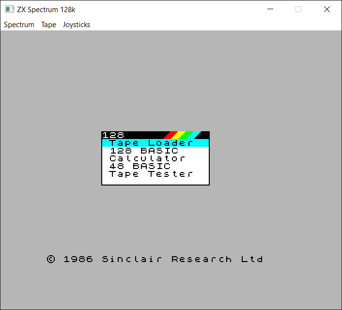
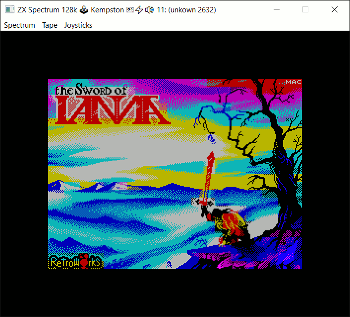
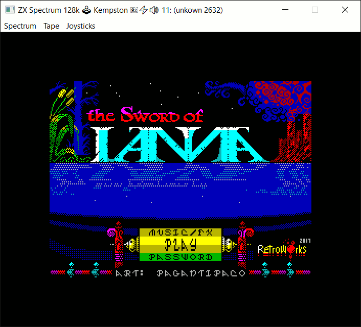
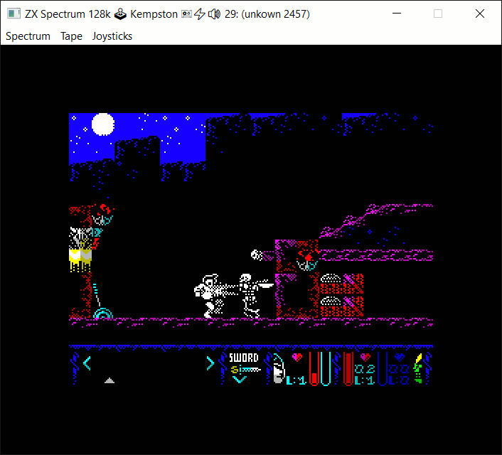

SPECTRUSTY Tutorial
===================

This is a part of the [tutorial] for the [SPECTRUSTY] library.

In this step, you can learn how to add different ZX Spectrum models with more peripherals.




Step 5 - 128
------------

128 means 128kb RAM. It also means:

* 32kB ROM with 128k software,
* ULA128 with MMU and shadow screen memory,
* an [AY-3-8910 Programmable Sound Processor](https://en.wikipedia.org/wiki/General_Instrument_AY-3-8910)
* .. with an [RS-232](https://en.wikipedia.org/wiki/RS-232) and an [external keypad](http://www.fruitcake.plus.com/Sinclair/Spectrum128/Keypad/Spectrum128Keypad.htm).

I'm going to skip the `RS-232` in this tutorial. But otherwise, we'll add a 128k model to the emulator that features all of the above.

First, update imports:

```rust
use spectrusty::audio::{
    AudioSample, EarMicAmps4, EarOutAmps4, EarInAmps2,
    Blep, BlepStereo, FromSample, UlaAudioFrame,
    synth::BandLimited,
    carousel::AudioFrameResult,
    host::cpal::AudioHandleAnyFormat
};
use spectrusty::bus::{
    BusDevice, NullDevice,
    joystick::{
        MultiJoystickBusDevice, JoystickSelect,
        JoystickInterface
    }
};
use spectrusty::clock::FTs;
use spectrusty::chip::{
    ControlUnit, HostConfig, MemoryAccess,
    UlaCommon, Ula128MemFlags, UlaControl,
    ThreadSyncTimer,
    ula::UlaPAL,
    ula128::Ula128
};
use spectrusty::peripherals::{
    ZXKeyboardMap,
    serial::{SerialKeypad, KeypadKeys},
    ay::audio::AyAmps
};
use spectrusty_utils::{
    tap::{Tape, Tap},
    keyboard::$implementation::{
        update_keymap, update_keypad_keys,
        update_joystick_from_key_event
    }
};
```

Where [`$implementation`][spectrusty-utils::keyboard] is one of the available keyboard implementations for event loops.

Next, let's refactor the `ZxSpectrum` struct by replacing `UlaPAL` with a generic `U` parameter:

```rust
#[derive(Default)]
struct ZxSpectrum<C: Cpu, U> {
    cpu: C,
    ula: U,
    nmi_request: bool,
    reset_request: Option<bool>,
    state: EmulatorState
}
```

The `reset_request` property works similarly to `nmi_request`.

[Ula128] provides a chipset implementation for ZX Spectrum 128k models. But we also need an emulator of [AY-3-8910 PSG][peripherals::ay] connected to the keypad via its IOA port. As you already know, we can "plug" it in as a static [bus device][serial128]. Let's create a new type `Ula128AyKeypad<D>`, for convenience. It will be used as our 128k chipset type:

```rust
// a specialized AY-3-8910 bus device with a keypad
use spectrusty::bus::ay::serial128::Ay3_8912Keypad;
// define Ula128 with a static mandatory device
type Ula128AyKeypad<D=TerminatorDevice> = Ula128<Ay3_8912Keypad<D>>;
```

The exposed `D` parameter can be substituted by a device connected to the PSG as its [NextDevice].
By default, `D` is our `TerminatorDevice`.

Now, let's again define generic models:

```rust
type ZxSpectrum16k<C, D> = ZxSpectrum<C, UlaPAL<Memory16k, D>>;
type ZxSpectrum48k<C, D> = ZxSpectrum<C, UlaPAL<Memory48k, D>>;
type ZxSpectrum128k<C, D> = ZxSpectrum<C, Ula128AyKeypad<D>>;
```

Now, let's look again at our pluggable-multi-joystick device:

```rust
// a pluggable joystick with run-time selectable joystick types
type PluggableMultiJoyBusDevice = OptionalBusDevice<
                                        MultiJoystickBusDevice<
                                                TerminatorDevice>>;
```

The last device in the chain determines the type of the [timestamp][BusDevice::Timestamp] used by the whole device chain.

So, let's look at our `TerminatorDevice` from the previous chapter:

```rust
type TerminatorDevice = NullDevice<VFrameTs<UlaVideoFrame>>;
```

Aha! It appears that our device chain is using [`VFrameTs<UlaVideoFrame>`][VFrameTs] as its [BusDevice::Timestamp].

This can be a problem with our new 128k model, because [Ula128] uses different [VideoFrame]: [Ula128VidFrame].

How do we solve this? Can't we just use another one that can work with all of our models?

Let's take a look at the [ControlUnit][ControlUnit-impl-Ula] implementation of [Ula]. It appears that we can use a different type for the timestamp. As long as it satisfies the condition: `From<VFrameTs<V: VideoFrame>>`.

As always, you can define your own timestamp type, but we already have one that fulfills such a requirement: [FTs].

```rust
type TerminatorDevice = NullDevice<FTs>;
```

That's it. Now we can use either `TerminatorDevice` or `PluggableMultiJoyBusDevice` with any of our generic models.

Let's now extend the model enum:

```rust
enum ZxSpectrumModel<C: Cpu, D: BusDevice=TerminatorDevice> {
    Spectrum16(ZxSpectrum16k<C, D>),
    Spectrum48(ZxSpectrum48k<C, D>),
    Spectrum128(ZxSpectrum128k<C, D>),
}
```

... and `ModelReq`:

```rust
#[derive(Debug, Clone, Copy)]
enum ModelReq {
    Spectrum16,
    Spectrum48,
    Spectrum128,
}
```

Because the 128k model uses different ROM again, for the sake of simplicity, let's embed the ROM binaries in the executable, instead of loading them in run time.

```rust
// add ROMS to the binary resources
static ROM48: &[u8]    = include_bytes!("../resources/roms/48.rom");
static ROM128_0: &[u8] = include_bytes!("../resources/roms/128-0.rom");
static ROM128_1: &[u8] = include_bytes!("../resources/roms/128-1.rom");
```

You may download ROM files from [here](https://github.com/royaltm/spectrusty/tree/master/resources).

Let's also create dedicated methods for initializing each of the model types, concerning different ROMs:

```rust
impl<C: Cpu, M: ZxMemory, D: BusDevice> ZxSpectrum<C, UlaPAL<M, D>>
    where Self: Default
{
    fn new_with_rom() -> Self {
        let mut spectrum = Self::default();
        let mem = spectrum.ula.memory_mut();
        mem.fill_mem(.., random).unwrap();
        mem.load_into_rom(ROM48).unwrap();
        spectrum
    }
}

impl<C: Cpu, D: BusDevice> ZxSpectrum<C, Ula128AyKeypad<D>>
    where Self: Default
{
    fn new_with_rom() -> Self {
        let mut spectrum = Self::default();
        let mem = spectrum.ula.memory_mut();
        mem.fill_mem(.., random).unwrap();
        mem.load_into_rom_bank(0, ROM128_0).unwrap();
        mem.load_into_rom_bank(1, ROM128_1).unwrap();
        spectrum
    }
}
```

[][sword-of-ianna]


### Device access

Perhaps it's time to refactor access to joysticks. We also need a way to access the [128 keypad][SerialKeypad] to make it work with the user keyboard.

The `JoystickAccess` trait doesn't need to be changed. I'll just list it here for reference:

```rust
trait JoystickAccess {
    type JoystickInterface: JoystickInterface + ?Sized;
    // Universal joystick interface access
    fn joystick_interface(&mut self) -> Option<&mut Self::JoystickInterface> {
        None
    }
    // Does nothing by default.
    fn select_joystick(&mut self, _joy: usize) {}
    fn current_joystick(&self) -> Option<&str> {
        None
    }
}
```

Nevertheless, it has to be reimplemented. But instead of doing it for each `ZxSpectrum` type, let's write a single implementation using an intermediate:

```rust
type SerialKeypad128 = SerialKeypad<FTs>;

trait DeviceAccess {
    type JoystickDevice;

    fn joystick_bus_device_mut(&mut self) -> Option<&mut Self::JoystickDevice> {
        None
    }
    fn joystick_bus_device_ref(&self) -> Option<&Self::JoystickDevice> {
        None
    }
    fn keypad128_mut(&mut self) -> Option<&mut SerialKeypad128> {
        None
    }
}
```

`DeviceAccess` will be implemented directly on the chipset instead of the model struct and will give us conditional access to the joystick device as well as to the [128 keypad][SerialKeypad].

Having defined an intermediate, we can now implement `JoystickAccess`.

```rust
impl<C: Cpu, U: UlaCommon> JoystickAccess for ZxSpectrum<C, U>
    where U: DeviceAccess<JoystickDevice = PluggableMultiJoyBusDevice>
{
    type JoystickInterface = dyn JoystickInterface;

    fn joystick_interface(
            &mut self
        ) -> Option<&mut Self::JoystickInterface>
    {
        let sub_joy = self.state.sub_joy;
        self.ula.joystick_bus_device_mut().and_then(|joy_bus_dev| {
            joy_bus_dev.as_deref_mut()
                       .and_then(|j| j.joystick_interface(sub_joy))
        })
    }

    fn select_joystick(&mut self, joy_index: usize) {
        if let Some(joy_bus_dev) = self.ula.joystick_bus_device_mut() {
            let (joy_dev, index) = JoystickSelect::new_with_index(joy_index)
                .map(|(joy_sel, index)| 
                    (Some(MultiJoystickBusDevice::new_with(joy_sel)), index)
                )
                .unwrap_or((None, 0));
            **joy_bus_dev = joy_dev;
            self.state.sub_joy = index;
        }
    }

    fn current_joystick(&self) -> Option<&str> {
        self.ula.joystick_bus_device_ref()
                .and_then(|jbd| jbd.as_deref().map(Into::into))
    }
}
```

The implementation is similar to the one used in [step 4][step4-make-it-selectable]. But this time, we are using methods of `DeviceAccess` trait to get access to the very specific `DeviceAccess::JoystickDevice` implementation. This is reflected in the `where` condition set for the generic type `U`.

Time to get busy with `DeviceAccess`:

```rust
// implement for Ula with a default device for completness
impl<M: ZxMemory> DeviceAccess for UlaPAL<M> {
    type JoystickDevice = PluggableMultiJoyBusDevice;
}

// implement for Ula with a joystick device
impl<M: ZxMemory> DeviceAccess for UlaPAL<M, PluggableMultiJoyBusDevice> {
    type JoystickDevice = PluggableMultiJoyBusDevice;

    fn joystick_bus_device_mut(
            &mut self
        ) -> Option<&mut Self::JoystickDevice>
    {
        Some(self.bus_device_mut())
    }

    fn joystick_bus_device_ref(&self) -> Option<&Self::JoystickDevice> {
        Some(self.bus_device_ref())
    }
}

// implement for Ula128 with a default device for completness
impl DeviceAccess for Ula128AyKeypad {
    type JoystickDevice = PluggableMultiJoyBusDevice;

    fn keypad128_mut(&mut self) -> Option<&mut SerialKeypad128> {
        Some(&mut self.bus_device_mut().ay_io.port_a.serial1)
    }
}

// implement for Ula128 with a joystick device
impl DeviceAccess for Ula128AyKeypad<PluggableMultiJoyBusDevice> {
    type JoystickDevice = PluggableMultiJoyBusDevice;

    fn joystick_bus_device_mut(
            &mut self
        ) -> Option<&mut Self::JoystickDevice>
    {
        Some(self.bus_device_mut().next_device_mut())
    }

    fn joystick_bus_device_ref(&self) -> Option<&Self::JoystickDevice> {
        Some(self.bus_device_ref().next_device_ref())
    }

    fn keypad128_mut(&mut self) -> Option<&mut SerialKeypad128> {
        Some(&mut self.bus_device_mut().ay_io.port_a.serial1)
    }
}
```

As we already know, the joystick device for [Ula128] is positioned slightly deeper in the device chain because we made its first device a sound processor. The [128 keypad][SerialKeypad] is connected to the PSG's IO port `A`. 128k ROM routines are using this port for connecting to both the keypad (AUX - serial port 1) and the [RS-232][Rs232Io] (SER - serial port 2). But in this example, we won't be using the second serial port for the RS-232 connection. You can check [this example](https://github.com/royaltm/spectrusty/tree/master/examples/sdl2-zxspectrum) to see how to implement both.


### Hot-swap

Having dealt with devices, now we can focus on the hot-swap function, as it will be slightly more challenging.

```rust
use std::io::{self, Read};

impl<C, D, M> From<ZxSpectrumModel<C, D>> for ZxSpectrum<C, UlaPAL<M, D>>
    where C: Cpu,
          D: BusDevice<Timestamp=FTs> + Default,
          M: ZxMemory,
          Self: Default
{
    fn from(model: ZxSpectrumModel<C, D>) -> Self {
        let border = model.border_color();
        let mut spectrum = Self::new_with_rom();
        let mem_rd = model.read_ram();
        let _ = spectrum.ula.memory_mut()
                            .load_into_mem(M::PAGE_SIZE as u16.., mem_rd);
        let (cpu, dev, state) = model.into_cpu_device_and_state();
        spectrum.cpu = cpu;
        spectrum.state = state;
        spectrum.ula.set_border_color(border);
        *spectrum.ula.bus_device_mut() = dev;
        spectrum
    }
}

impl<C, D> From<ZxSpectrumModel<C, D>> for ZxSpectrum<C, Ula128AyKeypad<D>>
    where C: Cpu,
          D: BusDevice<Timestamp=FTs> + Default,
          Self: Default
{
    fn from(model: ZxSpectrumModel<C, D>) -> Self {
        let border = model.border_color();
        let mut spectrum = Self::new_with_rom();
        let mem_rd = model.read_ram();
        let _ = spectrum.ula.memory_mut().load_into_mem(
                <Ula128 as MemoryAccess>::Memory::PAGE_SIZE as u16..,
                mem_rd);
        let (cpu, dev, state) = model.into_cpu_device_and_state();
        spectrum.cpu = cpu;
        spectrum.state = state;
        spectrum.ula.set_border_color(border);
        *spectrum.ula.bus_device_mut().next_device_mut() = dev;
        // lock in 48k mode until reset
        spectrum.ula.set_ula128_mem_port_value(Ula128MemFlags::ROM_BANK
                                              |Ula128MemFlags::LOCK_MMU);
        spectrum
    }
}
```

We need to deal with the fact that the last bank of RAM can be swapped in the 128k model. Instead of copying slices of linear memory, we'll use a reader to copy the content of the last visible 3 pages of RAM. So the reader can have different implementation concerning the model used.

Now, for the implementation of model enum helpers:

```rust
impl<C: Cpu, D> ZxSpectrumModel<C, D>
    where D: BusDevice<Timestamp=FTs> + Default
{
    fn into_cpu_device_and_state(self) -> (C, D, EmulatorState) {
        match self {
            ZxSpectrumModel::Spectrum16(spec16) => (
                spec16.cpu, spec16.ula.into_bus_device(), spec16.state
            ),
            ZxSpectrumModel::Spectrum48(spec48) => (
                spec48.cpu, spec48.ula.into_bus_device(), spec48.state
            ),
            ZxSpectrumModel::Spectrum128(spec128) => (
                spec128.cpu,
                spec128.ula.into_bus_device().into_next_device(),
                spec128.state
            ),
        }        
    }
    // returns a dynamically dispatched reader from RAM
    fn read_ram<'a>(&'a self) -> Box<dyn Read + 'a> {
        match self {
            ZxSpectrumModel::Spectrum16(spec16) =>
                Box::new(spec16.ula.memory_ref().ram_ref()
                                                .chain(io::repeat(!0))),
            ZxSpectrumModel::Spectrum48(spec48) =>
                Box::new(spec48.ula.memory_ref().ram_ref()),
            ZxSpectrumModel::Spectrum128(spec128) => {
                let mem = spec128.ula.memory_ref();
                // returns paged in RAM banks as a chained reader
                Box::new(mem.page_ref(1).unwrap()
                    .chain(mem.page_ref(2).unwrap())
                    .chain(mem.page_ref(3).unwrap()))
            }
        }
    }

    fn border_color(&self) -> BorderColor  {
        match self {
            ZxSpectrumModel::Spectrum16(spec16) =>
                                        spec16.ula.border_color(),
            ZxSpectrumModel::Spectrum48(spec48) =>
                                        spec48.ula.border_color(),
            ZxSpectrumModel::Spectrum128(spec128) =>
                                        spec128.ula.border_color(),
        }
    }
    // hot-swap hardware models
    fn change_model(self, request: ModelReq) -> Self {
        use ZxSpectrumModel::*;
        match (&self, request) {
            (Spectrum16(..), ModelReq::Spectrum16)|
            (Spectrum48(..), ModelReq::Spectrum48)|
            (Spectrum128(..), ModelReq::Spectrum128) => return self,
            _ => {}
        }
        match request {
            ModelReq::Spectrum16 => Spectrum16(self.into()),
            ModelReq::Spectrum48 => Spectrum48(self.into()),
            ModelReq::Spectrum128 => Spectrum128(self.into())
        }
    }
}
```

[][sword-of-ianna]


### 128 Keypad

There are a few things that need to be updated in the `run` method:

```rust
fn run<C: Cpu, U>(
        spectrum: &mut ZxSpectrum<C, U>,
        env: HostEnvironment,
    ) -> Result<Action>
    where U: UlaCommon
           + UlaAudioFrame<BandLim>
           + DeviceAccess
           + HostConfig,
          ZxSpectrum<C, U>: JoystickAccess
{
    //... ✂
    // ensure the Blep implementation is prepared for pulses
    spectrum.ula.ensure_audio_frame_time(
                            blep, audio.sample_rate(), U::CPU_HZ as f64);
    //... ✂
    let mut sync = ThreadSyncTimer::new(U::frame_duration_nanos());
    //... ✂
    'main: while is_running() {
        process_keyboard_events(
            |KeyEvent { key, pressed, shift_down, ctrl_down }| {
            if !update_joystick_from_key_event(key, pressed, FIRE_KEY,
                                    || spectrum.joystick_interface())
            {
                spectrum.update_keyboard(|keymap|
                    update_keymap(
                        keymap, key, pressed, shift_down, ctrl_down)
                );
                spectrum.update_keypad128_keys(|padmap|
                    update_keypad_keys(
                        padmap, key, pressed, shift_down || ctrl_down)
                );
            }
        });
        //... ✂
    }
    //... ✂
}
```

The method's signature has changed, and the more elaborate constraint is needed as we are now using a generic `U` type instead of `UlaPAL` struct. Next, we have to make room for the audio frames in the `blep` buffer. Different chipsets can have a different number of cycles per frame, and so the duration of the single-frame pass can change. Lastly, we need to add a way to provide keyboard events to the [128 keypad][SerialKeypad].

[UlaCommon] is a trait that groups various commonly used functions for ULA family chipsets. [UlaAudioFrame] is a trait that groups audio-related functions.

A few methods in `ZxSpectrum` only need to be changed slightly, and we have a new function - `update_keypad128_keys`.

The implementation header, of course, reflects the changes:

```rust
impl<C: Cpu, U> ZxSpectrum<C, U>
    where U: UlaCommon,
          Self: JoystickAccess
{
    //... ✂
    fn update_keypad128_keys<F: FnOnce(KeypadKeys) -> KeypadKeys>(
            &mut self,
            update_keys: F
        )
        where U: DeviceAccess
    {
        if let Some(keypad) = self.ula.keypad128_mut() {
            let padmap = update_keys( keypad.get_key_state() );
            keypad.set_key_state(padmap);
        }
    }

    fn run_frame(&mut self) -> Result<(FTs, bool)> {
        //... ✂
        if self.nmi_request && self.ula.nmi(&mut self.cpu) {
            // clear nmi_request only if the triggering succeeded
            self.nmi_request = false;
        }
        if let Some(hard) = self.reset_request.take() {
            self.ula.reset(&mut self.cpu, hard);
        }
        self.ula.execute_next_frame(&mut self.cpu);
        //... ✂
    }

    fn reset(&mut self, hard: bool) {
        self.reset_request = Some(hard);
    }

    fn update_on_user_request(
            &mut self,
            input: InputRequest
        ) -> Result<Option<Action>>
    {
        match menu_id {
            //... ✂
            Spectrum128 => return Ok(Some(Action::ChangeModel(
                                                ModelReq::Spectrum128))),
            //... ✂
        }
    }
    //... ✂
}
```


### Stereo

Because we have an additional source of the sound - a PSG, we need to update the `render_audio` method.

```rust
impl<C: Cpu, U> ZxSpectrum<C, U>
    //... ✂
{
    fn render_audio<B: Blep<SampleDelta=BlepDelta>>(
            &mut self, blep: &mut B
        ) -> usize
        where U: UlaAudioFrame<B>
    {
        self.ula.render_ay_audio_frame::<AyAmps<BlepDelta>>(blep,
                                                            [0, 1, 2]);
        // (1) add some amplitude steps to the BLEP that correspond to the EAR/MIC line changes
        if self.state.audible_tape {
            // render both EAR/MIC OUT channel
            self.ula.render_earmic_out_audio_frame::<
                EarMicAmps4<BlepDelta>
            >(blep, 2);
            // and the EAR IN channel
            self.ula.render_ear_in_audio_frame::<
                EarInAmps2<BlepDelta>
            >(blep, 2);
        }
        else {
            // render only EAR OUT channel
            self.ula.render_earmic_out_audio_frame::<
                EarOutAmps4<BlepDelta>
            >(blep, 2);
        }
        // (2) finalize the BLEP frame
        self.ula.end_audio_frame(blep)
    }
    //... ✂
}
```

You might have noticed that our `BandLim` is initialized with a single channel only. But now, we somehow need 3?
Well... we need to change it:

```rust
// the type of the Blep implementation
type BandLim = BlepStereo<BandLimited<BlepDelta>>;
```

and initialize it:

```rust
fn main() -> Result<()> {
    //... ✂
    let mut blep = BlepStereo::build(0.8)(
                        BandLimited::<BlepDelta>::new(2)
                   );
    //... ✂
}
```

Wait... why only 2? What is the 3rd channel then?

Thanks to [BlepStereo], which wraps a 2-channel [Blep]. Any channel indexed as 2 or higher will be directed to both channels simultaneously. So if the 1st channel (`0`) is left, the 2nd channel (`1`) is right, then the 3rd (`2`) is the center.

When calling [AyAudioFrame::render_ay_audio_frame] we can assign the `Blep` audio channels to `A, B, C` channels of the sound generator. In our example, we have: `[0, 1, 2]`, which is `A=0` (left), `B=1` (right), `C=2` (center).
This is the equivalent of `ACB` setting used in most of the emulators. For example if you want `ABC` you'll have to specify `A=0` (left), `B=2` (center), `C=1` (right), that is `[0, 2, 1]`. For monophonic output, you can use `[2, 2, 2]`.

Another thing to consider is that [AyAmps] can be replaced with [AyFuseAmps], or for that matter your own implementation of [AmpLevels]. Just remember that 4 bits will be used - values 0 to 15.

The last audio-related part to update is `produce_audio_frame`:

```rust
fn produce_audio_frame<T: AudioSample + FromSample<BlepDelta>>(
        output_channels: usize,
        outbuf: &mut Vec<T>,
        blep: &mut BandLim,
    )
{
    // the BLEP buffer summing iterator of the channel 0
    let sample_iter = blep.sum_iter::<T>(0);
    // the number of samples that the iterator will generate
    let frame_sample_count = sample_iter.len();
    // ensure the size of the audio frame buffer is exactly as we need it
    outbuf.resize(frame_sample_count * output_channels, T::silence());
    // zip with the other channel
    let sample_iter = sample_iter.zip(blep.sum_iter::<T>(1));
    // render each sample
    for (chans, (lsmp, rsmp)) in outbuf.chunks_mut(output_channels)
                                       .zip(sample_iter) {
        // write each sample to each channel
        for (ch, sample) in chans.iter_mut().zip(&[lsmp, rsmp]) {
            *ch = *sample;
        }
    }
}
```

We somewhat assume that the number of output channels for the host audio is at least 2.

And at last the `main` function. Let's also change the default model to 128k.

```rust
fn main() -> Result<()> {
    //... ✂
    // build the hardware
    let mut spec128 = ZxSpectrum128k::<Z80NMOS,
                                       PluggableMultiJoyBusDevice
                                      >::new_with_rom();
    // if the user provided the file name
    if let Some(file_name) = tap_file_name {
        //... ✂
        spec128.state.tape.tap = Some(Tap::Reader(iter_pulse));
        // or instead we could just write:
        // spec128.tape.insert_as_reader(tap_file);
        spec128.state.audible_tape = true;
        spec128.state.flash_tape = true;
    }
    //... ✂
    // width and height of the rendered frame image area in pixels
    let (width, height) = <Ula128 as Video>::render_size_pixels(border);
    //... ✂
    // initialize audio
    let frame_duration_nanos =
                        <Ula128 as HostConfig>::frame_duration_nanos();
    //... ✂
    let mut spectrum = ZxSpectrumModel::Spectrum128(spec128);

    loop {
        //... ✂
        let req = match &mut spectrum {
            Spectrum16(spec16) => run(spec16, env)?,
            Spectrum48(spec48) => run(spec48, env)?,
            Spectrum128(spec128) => run(spec128, env)?
        };
        //... ✂
    }

    Ok(())
}
```

[][sword-of-ianna]


### Example

The [example][step5.rs] program using [minifb] and [cpal], covering the scope of this tutorial can be run with:

```sh
cargo run --bin step5 --release -- resources/iana128.tap
```

Press `[ENTER]` and enjoy the 128k game.


### Next

Back to [index][tutorial].

<script>var clicky_site_ids = clicky_site_ids || []; clicky_site_ids.push(101270192);</script>
<script async src="//static.getclicky.com/js"></script>

[SPECTRUSTY]: https://royaltm.github.io/spectrusty/
[tutorial]: https://royaltm.github.io/spectrusty-tutorial/
[step5.rs]: https://github.com/royaltm/spectrusty-tutorial/blob/master/src/bin/step5.rs
[minifb]: https://crates.io/crates/minifb
[cpal]: https://crates.io/crates/cpal
[sword-of-ianna]: https://github.com/fjpena/sword-of-ianna-zx
[peripherals::ay]: https://docs.rs/spectrusty/*/spectrusty/peripherals/ay/index.html
[spectrusty-utils::keyboard]: https://docs.rs/spectrusty-utils/*/spectrusty_utils/keyboard/index.html
[serial128]: https://docs.rs/spectrusty/*/spectrusty/bus/ay/serial128/index.html
[AmpLevels]: https://docs.rs/spectrusty/*/spectrusty/audio/trait.AmpLevels.html
[Ay3_8912Keypad]: https://docs.rs/spectrusty/*/spectrusty/bus/ay/serial128/type.Ay3_8912Keypad.html
[AyAmps]: https://docs.rs/spectrusty/*/spectrusty/peripherals/ay/audio/struct.AyAmps.html
[AyAudioFrame::render_ay_audio_frame]: https://docs.rs/spectrusty/*/spectrusty/peripherals/ay/audio/trait.AyAudioFrame.html#tymethod.render_ay_audio_frame
[AyFuseAmps]: https://docs.rs/spectrusty/*/spectrusty/peripherals/ay/audio/struct.AyFuseAmps.html
[Blep]: https://docs.rs/spectrusty/*/spectrusty/audio/trait.Blep.html
[BlepStereo]: https://docs.rs/spectrusty/*/spectrusty/audio/struct.BlepStereo.html
[BusDevice::Timestamp]: https://docs.rs/spectrusty/*/spectrusty/bus/trait.BusDevice.html#associatedtype.Timestamp
[ControlUnit]: https://docs.rs/spectrusty/*/spectrusty/chip/trait.ControlUnit.html#associatedtype.BusDevice
[ControlUnit-impl-Ula]: https://docs.rs/spectrusty/*/spectrusty/chip/trait.ControlUnit.html#impl-ControlUnit-3
[FTs]: https://docs.rs/spectrusty/0.1.0/spectrusty/clock/type.FTs.html
[NextDevice]: https://docs.rs/spectrusty/*/spectrusty/bus/trait.BusDevice.html#associatedtype.NextDevice
[OptionalBusDevice]: https://docs.rs/spectrusty/*/spectrusty/bus/struct.OptionalBusDevice.html
[Rs232Io]: https://docs.rs/spectrusty/*/spectrusty/bus/ay/serial128/struct.Rs232Io.html
[SerialKeypad]: https://docs.rs/spectrusty/*/spectrusty/peripherals/serial/struct.SerialKeypad.html
[Ula]: https://docs.rs/spectrusty/*/spectrusty/chip/ula/struct.Ula.html
[Ula128]: https://docs.rs/spectrusty/*/spectrusty/chip/ula128/struct.Ula128.html
[Ula128VidFrame]: https://docs.rs/spectrusty/*/spectrusty/chip/ula128/struct.Ula128VidFrame.html
[UlaAudioFrame]: https://docs.rs/spectrusty/*/spectrusty/audio/trait.UlaAudioFrame.html
[UlaCommon]: https://docs.rs/spectrusty/*/spectrusty/chip/trait.UlaCommon.html
[UlaPAL]: https://docs.rs/spectrusty/*/spectrusty/chip/ula/type.UlaPAL.html
[VFrameTs]: https://docs.rs/spectrusty/*/spectrusty/clock/struct.VFrameTs.html
[VideoFrame]: https://docs.rs/spectrusty/*/spectrusty/video/trait.VideoFrame.html
[step4-make-it-selectable]: step4.html#make-it-selectable